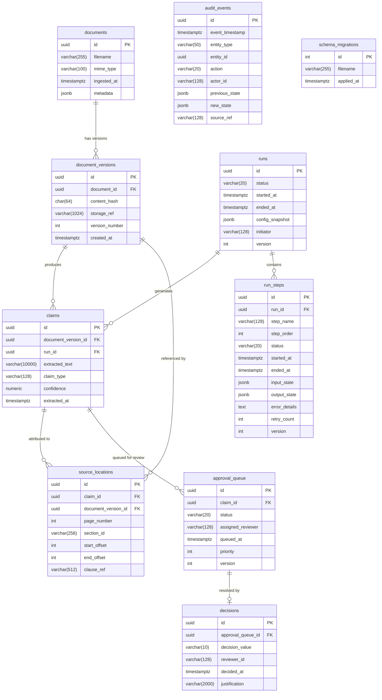

# Design Document: Core PostgreSQL Schema

## Overview

This design defines the PostgreSQL schema that underpins the agentic document-intelligence system. The schema provides:

- **Document lifecycle management** — ingestion, content-hash deduplication, and immutable version history
- **Claim extraction with source attribution** — linking factual assertions back to exact character spans in source documents
- **Pipeline run/step tracking** — enabling resumability after failures by checkpointing at the step level
- **Human-in-the-loop approval** — a queue/decision model where claims flow through pending → approved/rejected
- **Append-only audit trail** — every state change recorded immutably in the same transaction
- **Concurrent run safety** — advisory locks for reads, optimistic concurrency control (OCC) for writes

Target: `pgvector/pgvector:pg16` (PostgreSQL 16 + vector extension)  
ORM: SQLAlchemy (declarative models mapping to raw SQL migrations)  
Migration strategy: Sequential numbered SQL files, idempotent with `IF NOT EXISTS`

---

## Architecture

### Entity-Relationship Diagram



### High-Level Data Flow

```
Document ingested
  → document row + document_version row (content-hash deduplicated)
  → Run created (status: pending → running)
    → Steps executed sequentially (each checkpointed)
      → Claims extracted (linked to run + document_version)
        → Source_locations recorded per claim
        → Claims promoted to approval_queue (status: pending)
          → Human decision recorded → queue status updated
  → Audit_events written alongside every state change
```

---

## Components and Interfaces

### Table: `schema_migrations`

Tracks applied migrations. Must be created first (bootstrap).

| Column | Type | Constraints |
|--------|------|-------------|
| `id` | `INTEGER` | PRIMARY KEY |
| `filename` | `VARCHAR(255)` | NOT NULL |
| `applied_at` | `TIMESTAMPTZ` | NOT NULL DEFAULT NOW() |

### Table: `documents`

Stores top-level document metadata.

| Column | Type | Constraints |
|--------|------|-------------|
| `id` | `UUID` | PRIMARY KEY, DEFAULT gen_random_uuid() |
| `filename` | `VARCHAR(255)` | NOT NULL |
| `mime_type` | `VARCHAR(100)` | NOT NULL, CHECK (mime_type IN ('application/pdf', 'application/vnd.openxmlformats-officedocument.wordprocessingml.document', 'text/plain')) |
| `ingested_at` | `TIMESTAMPTZ` | NOT NULL DEFAULT NOW() |
| `metadata` | `JSONB` | NOT NULL DEFAULT '{}' |

**Indexes:**
- `idx_documents_mime_type` ON `documents(mime_type)`
- `idx_documents_ingested_at` ON `documents(ingested_at)`

### Table: `document_versions`

Immutable version snapshots. Content-hash deduplication prevents storing identical content twice.

| Column | Type | Constraints |
|--------|------|-------------|
| `id` | `UUID` | PRIMARY KEY, DEFAULT gen_random_uuid() |
| `document_id` | `UUID` | NOT NULL, FK → documents(id) ON DELETE RESTRICT |
| `content_hash` | `CHAR(64)` | NOT NULL |
| `storage_ref` | `VARCHAR(1024)` | NOT NULL |
| `version_number` | `INTEGER` | NOT NULL, CHECK (version_number >= 1) |
| `created_at` | `TIMESTAMPTZ` | NOT NULL DEFAULT NOW() |

**Constraints:**
- UNIQUE (`document_id`, `content_hash`) — deduplication within a document
- UNIQUE (`document_id`, `version_number`) — ordered versioning

**Indexes:**
- `idx_dv_document_id` ON `document_versions(document_id)`
- `idx_dv_content_hash` ON `document_versions(content_hash)`

**Immutability Trigger:** A BEFORE UPDATE trigger on `document_versions` raises an exception if `content_hash` or `storage_ref` is modified after insertion.

```sql
CREATE OR REPLACE FUNCTION prevent_version_mutation() RETURNS TRIGGER AS $$
BEGIN
  IF OLD.content_hash IS DISTINCT FROM NEW.content_hash THEN
    RAISE EXCEPTION 'content_hash is immutable';
  END IF;
  IF OLD.storage_ref IS DISTINCT FROM NEW.storage_ref THEN
    RAISE EXCEPTION 'storage_ref is immutable';
  END IF;
  RETURN NEW;
END;
$$ LANGUAGE plpgsql;
```

### Table: `runs`

Pipeline execution sessions.

| Column | Type | Constraints |
|--------|------|-------------|
| `id` | `UUID` | PRIMARY KEY, DEFAULT gen_random_uuid() |
| `status` | `VARCHAR(20)` | NOT NULL DEFAULT 'pending', CHECK (status IN ('pending', 'running', 'completed', 'failed', 'cancelled')) |
| `started_at` | `TIMESTAMPTZ` | NOT NULL DEFAULT NOW() |
| `ended_at` | `TIMESTAMPTZ` | NULL |
| `config_snapshot` | `JSONB` | NOT NULL DEFAULT '{}' |
| `initiator` | `VARCHAR(128)` | NOT NULL |
| `version` | `INTEGER` | NOT NULL DEFAULT 1 |

**Indexes:**
- `idx_runs_status` ON `runs(status)`
- `idx_runs_started_at` ON `runs(started_at)`

**State Machine Trigger:** A BEFORE UPDATE trigger enforces valid transitions:

```sql
CREATE OR REPLACE FUNCTION enforce_run_status_transition() RETURNS TRIGGER AS $$
DECLARE
  valid_transitions JSONB := '{
    "pending": ["running"],
    "running": ["completed", "failed", "cancelled"]
  }'::jsonb;
  allowed_next JSONB;
BEGIN
  IF OLD.status = NEW.status THEN RETURN NEW; END IF;
  allowed_next := valid_transitions -> OLD.status;
  IF allowed_next IS NULL OR NOT (allowed_next ? NEW.status) THEN
    RAISE EXCEPTION 'Invalid run status transition: % → %', OLD.status, NEW.status;
  END IF;
  NEW.version := OLD.version + 1;
  RETURN NEW;
END;
$$ LANGUAGE plpgsql;
```

### Table: `run_steps`

Individual checkpointed steps within a run.

| Column | Type | Constraints |
|--------|------|-------------|
| `id` | `UUID` | PRIMARY KEY, DEFAULT gen_random_uuid() |
| `run_id` | `UUID` | NOT NULL, FK → runs(id) ON DELETE RESTRICT |
| `step_name` | `VARCHAR(128)` | NOT NULL |
| `step_order` | `INTEGER` | NOT NULL, CHECK (step_order >= 1) |
| `status` | `VARCHAR(20)` | NOT NULL DEFAULT 'pending', CHECK (status IN ('pending', 'running', 'completed', 'failed', 'skipped')) |
| `started_at` | `TIMESTAMPTZ` | NULL |
| `ended_at` | `TIMESTAMPTZ` | NULL |
| `input_state` | `JSONB` | NOT NULL DEFAULT '{}' |
| `output_state` | `JSONB` | NOT NULL DEFAULT '{}' |
| `error_details` | `TEXT` | NULL |
| `retry_count` | `INTEGER` | NOT NULL DEFAULT 0, CHECK (retry_count >= 0 AND retry_count <= 10) |
| `version` | `INTEGER` | NOT NULL DEFAULT 1 |

**Constraints:**
- UNIQUE (`run_id`, `step_order`)

**Indexes:**
- `idx_run_steps_run_status_order` ON `run_steps(run_id, status, step_order DESC)` — resume query
- `idx_run_steps_run_id` ON `run_steps(run_id)`
- `idx_run_steps_status` ON `run_steps(status)`

**Resume Query Pattern:**
```sql
SELECT * FROM run_steps
WHERE run_id = $1 AND status = 'completed'
ORDER BY step_order DESC
LIMIT 1;
```

### Table: `claims`

Factual assertions extracted from document versions.

| Column | Type | Constraints |
|--------|------|-------------|
| `id` | `UUID` | PRIMARY KEY, DEFAULT gen_random_uuid() |
| `document_version_id` | `UUID` | NOT NULL, FK → document_versions(id) ON DELETE RESTRICT |
| `run_id` | `UUID` | NOT NULL, FK → runs(id) ON DELETE RESTRICT |
| `extracted_text` | `VARCHAR(10000)` | NOT NULL |
| `claim_type` | `VARCHAR(128)` | NOT NULL |
| `confidence` | `NUMERIC(4,3)` | NOT NULL, CHECK (confidence >= 0.0 AND confidence <= 1.0) |
| `extracted_at` | `TIMESTAMPTZ` | NOT NULL DEFAULT NOW() |

**Indexes:**
- `idx_claims_document_version_id` ON `claims(document_version_id)`
- `idx_claims_run_id` ON `claims(run_id)`
- `idx_claims_type` ON `claims(claim_type)`
- `idx_claims_confidence` ON `claims(confidence)`

### Table: `source_locations`

Precise positions within a document version where a claim originates.

| Column | Type | Constraints |
|--------|------|-------------|
| `id` | `UUID` | PRIMARY KEY, DEFAULT gen_random_uuid() |
| `claim_id` | `UUID` | NOT NULL, FK → claims(id) ON DELETE RESTRICT |
| `document_version_id` | `UUID` | NOT NULL, FK → document_versions(id) ON DELETE RESTRICT |
| `page_number` | `INTEGER` | NULL, CHECK (page_number >= 1 OR page_number IS NULL) |
| `section_id` | `VARCHAR(256)` | NULL |
| `start_offset` | `INTEGER` | NOT NULL, CHECK (start_offset >= 0) |
| `end_offset` | `INTEGER` | NOT NULL, CHECK (end_offset >= 0) |
| `clause_ref` | `VARCHAR(512)` | NULL |

**Constraints:**
- CHECK (`start_offset < end_offset`)

**Indexes:**
- `idx_source_locations_claim_id` ON `source_locations(claim_id)`
- `idx_source_locations_dv_id` ON `source_locations(document_version_id)`

### Table: `approval_queue`

Claims pending human review.

| Column | Type | Constraints |
|--------|------|-------------|
| `id` | `UUID` | PRIMARY KEY, DEFAULT gen_random_uuid() |
| `claim_id` | `UUID` | NOT NULL, FK → claims(id) ON DELETE RESTRICT |
| `status` | `VARCHAR(20)` | NOT NULL DEFAULT 'pending', CHECK (status IN ('pending', 'approved', 'rejected')) |
| `assigned_reviewer` | `VARCHAR(128)` | NULL |
| `queued_at` | `TIMESTAMPTZ` | NOT NULL DEFAULT NOW() |
| `priority` | `INTEGER` | NOT NULL DEFAULT 3, CHECK (priority >= 1 AND priority <= 5) |
| `version` | `INTEGER` | NOT NULL DEFAULT 1 |

**Indexes:**
- `idx_aq_claim_id` ON `approval_queue(claim_id)`
- `idx_aq_status` ON `approval_queue(status)`
- `idx_aq_status_priority_queued` ON `approval_queue(status, priority, queued_at)` — reviewer dashboard query
- `idx_aq_queued_at` ON `approval_queue(queued_at)`

### Table: `decisions`

Recorded human judgments on queued claims.

| Column | Type | Constraints |
|--------|------|-------------|
| `id` | `UUID` | PRIMARY KEY, DEFAULT gen_random_uuid() |
| `approval_queue_id` | `UUID` | NOT NULL, FK → approval_queue(id) ON DELETE RESTRICT, UNIQUE |
| `decision_value` | `VARCHAR(10)` | NOT NULL, CHECK (decision_value IN ('approved', 'rejected')) |
| `reviewer_id` | `VARCHAR(128)` | NOT NULL |
| `decided_at` | `TIMESTAMPTZ` | NOT NULL DEFAULT NOW() |
| `justification` | `VARCHAR(2000)` | NOT NULL, CHECK (length(justification) >= 1) |

**Indexes:**
- `idx_decisions_aq_id` ON `decisions(approval_queue_id)` (covered by UNIQUE)
- `idx_decisions_reviewer` ON `decisions(reviewer_id)`

**Decision Guard Trigger:** Prevents inserting a decision against a non-pending queue entry:

```sql
CREATE OR REPLACE FUNCTION guard_decision_on_pending() RETURNS TRIGGER AS $$
DECLARE
  queue_status VARCHAR(20);
BEGIN
  SELECT status INTO queue_status FROM approval_queue WHERE id = NEW.approval_queue_id;
  IF queue_status != 'pending' THEN
    RAISE EXCEPTION 'Cannot record decision: approval_queue entry is %, expected pending', queue_status;
  END IF;
  RETURN NEW;
END;
$$ LANGUAGE plpgsql;
```

### Table: `audit_events`

Immutable append-only record of all state changes.

| Column | Type | Constraints |
|--------|------|-------------|
| `id` | `UUID` | PRIMARY KEY, DEFAULT gen_random_uuid() |
| `event_timestamp` | `TIMESTAMPTZ` | NOT NULL DEFAULT NOW() |
| `entity_type` | `VARCHAR(50)` | NOT NULL, CHECK (entity_type IN ('document', 'document_version', 'claim', 'source_location', 'run', 'run_step', 'approval_queue', 'decision')) |
| `entity_id` | `UUID` | NOT NULL |
| `action` | `VARCHAR(20)` | NOT NULL, CHECK (action IN ('created', 'updated', 'status_changed', 'deleted')) |
| `actor_id` | `VARCHAR(128)` | NOT NULL |
| `previous_state` | `JSONB` | NULL |
| `new_state` | `JSONB` | NOT NULL |
| `source_ref` | `VARCHAR(128)` | NULL |

**Indexes:**
- `idx_audit_event_timestamp` ON `audit_events(event_timestamp)`
- `idx_audit_entity_history` ON `audit_events(entity_type, entity_id, event_timestamp)`
- `idx_audit_actor` ON `audit_events(actor_id)`

**Immutability Rule:** A BEFORE UPDATE OR DELETE trigger on `audit_events` raises an exception unconditionally:

```sql
CREATE OR REPLACE FUNCTION prevent_audit_mutation() RETURNS TRIGGER AS $$
BEGIN
  RAISE EXCEPTION 'audit_events is append-only: % operations are forbidden', TG_OP;
END;
$$ LANGUAGE plpgsql;
```

---

## Data Models

### SQLAlchemy Model Mapping Strategy

Each table maps to a SQLAlchemy declarative model in `src/models/`. The models follow these conventions:

- **Base class:** `DeclarativeBase` with a shared `metadata` instance
- **UUID PKs:** `Mapped[uuid.UUID]` with `server_default=text("gen_random_uuid()")`
- **Timestamps:** `Mapped[datetime]` with `server_default=text("NOW()")`
- **OCC columns:** `version` fields with `onupdate` logic in the repository layer (not ORM-managed auto-increment — explicit WHERE version = expected)

```python
# src/models/base.py
from sqlalchemy.orm import DeclarativeBase, Mapped, mapped_column
from sqlalchemy import text
import uuid
from datetime import datetime

class Base(DeclarativeBase):
    pass

class TimestampMixin:
    created_at: Mapped[datetime] = mapped_column(server_default=text("NOW()"))
```

### Key Type Mappings

| Domain Concept | Python Type | SQLAlchemy Column | PG Type |
|---------------|-------------|-------------------|---------|
| Identifiers | `uuid.UUID` | `Mapped[uuid.UUID]` | `UUID` |
| Timestamps | `datetime` | `Mapped[datetime]` | `TIMESTAMPTZ` |
| Status enums | `str` | `Mapped[str]` w/ CHECK | `VARCHAR(20)` |
| Content hash | `str` | `Mapped[str]` | `CHAR(64)` |
| Confidence | `Decimal` | `Mapped[Decimal]` | `NUMERIC(4,3)` |
| JSON blobs | `dict` | `Mapped[dict]` | `JSONB` |
| OCC version | `int` | `Mapped[int]` | `INTEGER` |

---

## Key Design Decisions

### 1. Run/Session Tracking for Resumability

**Finding the last completed step:**
```sql
SELECT * FROM run_steps
WHERE run_id = :run_id AND status = 'completed'
ORDER BY step_order DESC
LIMIT 1;
```
The composite index `(run_id, status, step_order DESC)` makes this a single index scan.

**Handling interrupted "running" steps:**
When a run resumes and finds a step with `status = 'running'` and `ended_at IS NULL`, the application marks it as `failed` with `error_details = 'interrupted: prior execution did not complete'` and increments `retry_count`. The next step in sequence then begins.

### 2. Document Versioning with Content-Hash Deduplication

The UNIQUE constraint on `(document_id, content_hash)` ensures that re-ingesting identical content for the same document is a no-op at the database level. The application layer catches the unique violation and returns the existing `document_version_id`. Different documents may share the same content hash (e.g., same file uploaded to two accounts) — this is intentional and acceptable.

### 3. Claims-to-Source Linking

One claim can have many source_locations (1:N relationship). This supports cross-reference claims like "APR stated on page 1 contradicts fee schedule on page 4" where a single claim is derived from multiple passages. Both `source_locations.claim_id` and `source_locations.document_version_id` are NOT NULL foreign keys, ensuring every source location is anchored to both a claim and a specific version.

### 4. Pending-Approval Queue Flow

```
Claim extracted → approval_queue entry (status: pending)
                   → Reviewer picks up → Decision recorded
                     → approved: queue status → 'approved'
                     → rejected: queue status → 'rejected'
                       → Claim re-extracted → NEW queue entry (fresh pending)
```

Key: rejected claims get a *new* queue entry, preserving the full decision history. The UNIQUE constraint on `decisions.approval_queue_id` ensures exactly one decision per queue entry. The trigger `guard_decision_on_pending` prevents recording decisions against already-resolved entries.

### 5. Audit Trail Implementation

- **Same-transaction insertion:** Application code wraps every state change + its audit_event insert in a single `BEGIN … COMMIT`. If either fails, both roll back.
- **Append-only enforcement:** The `prevent_audit_mutation` trigger makes UPDATE/DELETE physically impossible on `audit_events`.
- **Entity history query:** The composite index `(entity_type, entity_id, event_timestamp)` supports `SELECT * FROM audit_events WHERE entity_type = :type AND entity_id = :id ORDER BY event_timestamp`.

### 6. Concurrency Control

**Reads (advisory locks):** When a run reads document_versions, it acquires a shared advisory lock on the document_id (using `pg_advisory_xact_lock_shared`). Multiple runs can hold the shared lock concurrently — no blocking for reads.

**Writes (OCC):** The `version` column on `runs`, `run_steps`, and `approval_queue` implements optimistic concurrency control. Every UPDATE includes `WHERE version = :expected_version` and sets `version = version + 1`. Zero affected rows = conflict → application retries or reports error.

---

## Index Strategy

| Query Pattern | Table | Index | Notes |
|--------------|-------|-------|-------|
| Resume: find last completed step | `run_steps` | `(run_id, status, step_order DESC)` | Covers the resume query directly |
| Reviewer dashboard: pending claims by priority | `approval_queue` | `(status, priority, queued_at)` | Supports `WHERE status='pending' ORDER BY priority, queued_at` |
| Entity audit history | `audit_events` | `(entity_type, entity_id, event_timestamp)` | Full history of any entity |
| Time-range audit queries | `audit_events` | `(event_timestamp)` | "What happened in the last hour?" |
| Deduplication check | `document_versions` | `(document_id, content_hash)` UNIQUE | Catches duplicates at insert time |
| Claims by run | `claims` | `(run_id)` | "Show all claims from run X" |
| Claims by document version | `claims` | `(document_version_id)` | "Show all claims for this version" |
| Source locations for a claim | `source_locations` | `(claim_id)` | Join path from claim to sources |
| All FK columns | all tables | individual btree indexes | Required by requirement 7.4 |

---

## Migration Structure

Migrations live in `migrations/` at the project root. Each file is a self-contained SQL transaction.

| File | Purpose |
|------|---------|
| `001_extensions_and_migrations.sql` | Enable `pgcrypto` and `vector` extensions; create `schema_migrations` table |
| `002_documents_and_versions.sql` | Create `documents`, `document_versions`, immutability trigger |
| `003_runs_and_steps.sql` | Create `runs`, `run_steps`, status machine trigger |
| `004_claims_and_sources.sql` | Create `claims`, `source_locations` |
| `005_approval_queue.sql` | Create `approval_queue`, `decisions`, decision guard trigger |
| `006_audit_events.sql` | Create `audit_events`, append-only trigger |
| `007_indexes.sql` | Create all non-primary-key indexes |

Each migration:
1. Uses `IF NOT EXISTS` for idempotency
2. Wraps in `BEGIN … COMMIT`
3. Records itself in `schema_migrations` on success


---

## Correctness Properties

*A property is a characteristic or behavior that should hold true across all valid executions of a system — essentially, a formal statement about what the system should do. Properties serve as the bridge between human-readable specifications and machine-verifiable correctness guarantees.*

### Property 1: MIME Type Validation

*For any* string value used as `mime_type` when inserting into the `documents` table, the insertion SHALL succeed if and only if the value is one of `'application/pdf'`, `'application/vnd.openxmlformats-officedocument.wordprocessingml.document'`, or `'text/plain'`.

**Validates: Requirements 1.1, 1.6**

### Property 2: Content-Hash Deduplication

*For any* document and any content hash, inserting a second `document_versions` row with the same `(document_id, content_hash)` pair SHALL raise a unique constraint violation, while inserting with a different content hash or different document_id SHALL succeed.

**Validates: Requirements 1.3, 7.5**

### Property 3: Document Version Immutability

*For any* existing `document_versions` row, any UPDATE that modifies `content_hash` or `storage_ref` SHALL be rejected by the immutability trigger, regardless of the new values provided.

**Validates: Requirements 1.4**

### Property 4: Composite Unique Constraints

*For any* `(document_id, version_number)` pair in `document_versions` or `(run_id, step_order)` pair in `run_steps`, inserting a duplicate combination SHALL raise a unique constraint violation.

**Validates: Requirements 1.5, 3.5**

### Property 5: Source Location Offset Ordering

*For any* pair of integers `(start_offset, end_offset)`, insertion into `source_locations` SHALL succeed only when `start_offset < end_offset`, and SHALL be rejected otherwise.

**Validates: Requirements 2.5**

### Property 6: Resume Query Correctness

*For any* run with an arbitrary sequence of steps in various statuses, querying `run_steps WHERE run_id = :id AND status = 'completed' ORDER BY step_order DESC LIMIT 1` SHALL return the step with the highest `step_order` among all completed steps for that run, or no rows if none are completed.

**Validates: Requirements 3.3**

### Property 7: Run Status State Machine

*For any* run with a current status, a status UPDATE SHALL succeed only if the transition is valid according to the state machine (pending → running, running → completed|failed|cancelled), and SHALL be rejected for all other transitions including backward transitions.

**Validates: Requirements 3.4**

### Property 8: Optimistic Concurrency Control

*For any* row in `runs`, `run_steps`, or `approval_queue` with a current `version` value V, an UPDATE with `WHERE version = V` SHALL affect exactly one row and increment version to V+1, while an UPDATE with `WHERE version != V` SHALL affect zero rows.

**Validates: Requirements 4.5, 4.6**

### Property 9: One Decision Per Queue Entry

*For any* `approval_queue` entry that already has a recorded decision, attempting to insert a second `decisions` row referencing the same `approval_queue_id` SHALL raise a unique constraint violation.

**Validates: Requirements 5.5**

### Property 10: Decision Guard on Pending Status

*For any* `approval_queue` entry whose status is NOT `'pending'` (i.e., `'approved'` or `'rejected'`), attempting to insert a `decisions` row referencing that entry SHALL be rejected by the guard trigger.

**Validates: Requirements 5.7**

### Property 11: Audit Events Append-Only

*For any* existing row in the `audit_events` table, any UPDATE or DELETE operation SHALL be rejected by the immutability trigger unconditionally.

**Validates: Requirements 6.2**

### Property 12: Audit Entity History Ordering

*For any* entity identified by `(entity_type, entity_id)`, querying `audit_events` filtered by that pair and ordered by `event_timestamp` SHALL return all historical state changes for that entity in chronological order.

**Validates: Requirements 6.4**

### Property 13: ON DELETE RESTRICT Enforcement

*For any* parent record in `documents`, `document_versions`, `claims`, `runs`, or `approval_queue` that has at least one child row referencing it, a DELETE on the parent SHALL be rejected with a foreign key violation.

**Validates: Requirements 7.2**

### Property 14: Migration Idempotency

*For any* migration file, applying it to a database where it has already been applied SHALL produce no errors and no schema changes, due to `IF NOT EXISTS` guards on all DDL statements.

**Validates: Requirements 8.4**

---

## Error Handling

### Database-Level Error Handling

| Error Condition | Mechanism | Behavior |
|----------------|-----------|----------|
| Invalid MIME type | CHECK constraint | Raises `check_violation` (23514) |
| Duplicate content hash | UNIQUE constraint | Raises `unique_violation` (23505) |
| Immutable field update | BEFORE UPDATE trigger | Raises custom exception |
| Invalid status transition | BEFORE UPDATE trigger | Raises custom exception with transition details |
| FK parent deletion | ON DELETE RESTRICT | Raises `foreign_key_violation` (23503) |
| Audit mutation attempt | BEFORE UPDATE/DELETE trigger | Raises custom exception |
| Decision on non-pending entry | BEFORE INSERT trigger | Raises custom exception |
| OCC version mismatch | Application WHERE clause | Zero rows affected (no DB error) |
| NULL FK column | NOT NULL constraint | Raises `not_null_violation` (23502) |

### Application-Level Error Handling

The SQLAlchemy repository layer translates database exceptions into domain exceptions:

```python
class ConflictError(Exception):
    """OCC version mismatch — retry or report."""

class ImmutableFieldError(Exception):
    """Attempted modification of immutable data."""

class InvalidTransitionError(Exception):
    """Status transition violates state machine."""

class DuplicateContentError(Exception):
    """Content hash already exists for this document."""
```

**Transaction rollback guarantee:** All operations are wrapped in SQLAlchemy sessions with explicit `begin()` / `commit()` boundaries. Any unhandled exception triggers automatic rollback, ensuring audit_events and state changes remain atomically consistent.

**Retry strategy for OCC conflicts:**
1. Read current row (fresh version)
2. Re-apply business logic
3. Attempt update with new version
4. Max 3 retries before raising `ConflictError`

---

## Testing Strategy

### Unit Tests (Example-Based)

- **Schema smoke tests:** Verify all tables, columns, constraints, and indexes exist with correct types
- **Single-scenario tests:** Insert/read/update flows for each table
- **Edge cases:** NULL handling, boundary values (confidence = 0.0, 1.0), maximum-length strings
- **Error paths:** Verify correct exceptions for each constraint violation type
- **State machine specific transitions:** Each valid and invalid transition pair

### Property-Based Tests (Hypothesis)

**Library:** [Hypothesis](https://hypothesis.readthedocs.io/) for Python  
**Configuration:** Minimum 100 examples per property test  
**Tag format:** `# Feature: core-postgres-schema, Property {N}: {title}`

Each correctness property (1–14) maps to a single Hypothesis test that generates random valid/invalid inputs and asserts the property holds universally. Key generators:

- **MIME types:** `st.sampled_from(valid_mimes) | st.text()` for valid/invalid
- **Content hashes:** `st.text(alphabet='0123456789abcdef', min_size=64, max_size=64)`
- **Status transitions:** `st.tuples(st.sampled_from(statuses), st.sampled_from(statuses))`
- **Offset pairs:** `st.tuples(st.integers(min_value=0), st.integers(min_value=0))`
- **Step sequences:** `st.lists(st.tuples(st.integers(min_value=1), st.sampled_from(step_statuses)))`

### Integration Tests

- **Concurrent advisory locks:** Two sessions acquiring shared locks on the same document
- **Transaction atomicity:** Audit event failure causes full rollback
- **Migration runner:** Apply/re-apply migrations, verify schema state
- **End-to-end flow:** Document → Version → Run → Steps → Claims → Queue → Decision → Audit trail

### Test Infrastructure

- **Database:** Dedicated test database (`docdb_test`) created in Docker Compose
- **Isolation:** Each test gets a fresh transaction that rolls back after assertion (no cleanup needed)
- **Fixtures:** `pytest` fixtures providing pre-populated documents, runs, claims for relationship tests
