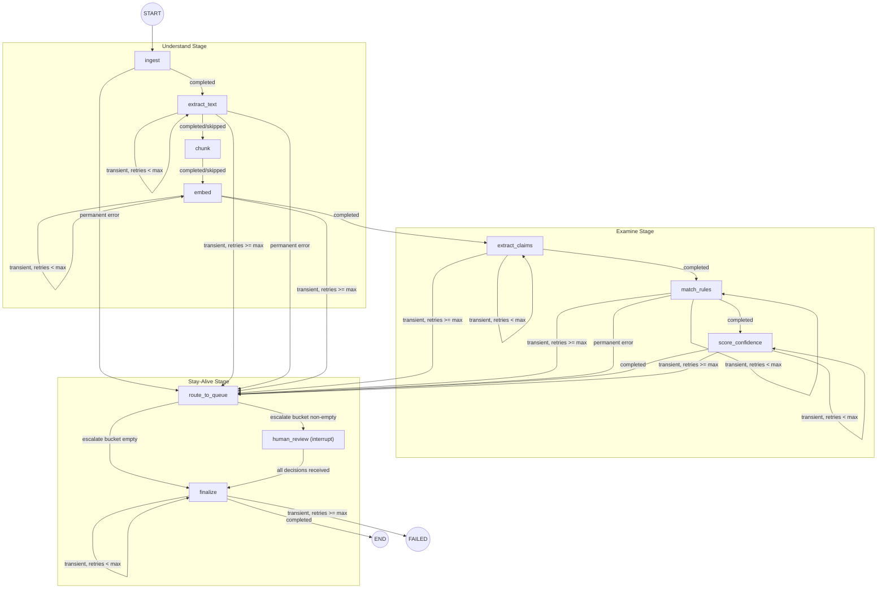

# Design Document: LangGraph Pipeline Design

## Overview

This design specifies the LangGraph `StateGraph` topology for the three-stage document-intelligence pipeline: **Understand → Examine → Stay-Alive**. The pipeline processes synthetic microfinance and consumer loan agreements through ingestion, compliance analysis, and human-in-the-loop monitoring.

**Key principles:**

- **Conditional routing** — Every node-to-node transition is a conditional edge whose routing function inspects the returned State. No unconditional edges exist.
- **Per-node checkpointing** — After each successful node, the full State is persisted to the `run_steps.output_state` JSONB column within the same transaction that marks the step complete.
- **Kill-and-resume** — A crashed or killed run restores from the last checkpoint and resumes at the next conditional edge, never re-executing completed work.
- **Bounded retry** — Transient failures retry in-place up to a configurable max (default 3), then escalate.
- **Human-in-the-loop** — Low-confidence or non-compliant results park in the approval queue; the graph suspends via `interrupt()` and resumes only after all decisions arrive.

The pipeline is architecture-only — this spec defines graph shape, node contracts, routing logic, checkpoint boundaries, and state schema. Implementation code is produced by subsequent specs.

---

## Architecture

### Pipeline Graph Topology



### Stage Boundaries and Cross-Stage Edges

| Transition | From Stage | To Stage | Mechanism |
|-----------|-----------|----------|-----------|
| `embed` → `extract_claims` | Understand | Examine | Conditional edge (same as intra-stage) |
| `score_confidence` → `route_to_queue` | Examine | Stay-Alive | Conditional edge (same as intra-stage) |
| Any node → `route_to_queue` (escalation) | Any | Stay-Alive | Conditional edge on error/escalation |

Cross-stage transitions use the identical `add_conditional_edges` API as intra-stage transitions — there is no special handling for stage boundaries.

---

## State Schema


### Full TypedDict Definition

```python
from typing import TypedDict, Literal, Optional
from uuid import UUID

class ChunkEntry(TypedDict):
    index: int
    text: str
    start_offset: int
    end_offset: int

class ExtractionResult(TypedDict):
    claim_id: str
    claim_text: str
    chunk_index: int
    start_offset: int
    end_offset: int
    confidence: float  # 0.0–1.0

class ComplianceVerdict(TypedDict):
    claim_id: str
    verdict: Literal["compliant", "non_compliant", "indeterminate"]
    confidence: float  # 0.0–1.0
    needs_human_review: bool
    rule_id: Optional[str]
    evidence_refs: list[str]

class Decision(TypedDict):
    claim_id: str
    approval_queue_id: str
    decision_value: Literal["approved", "rejected"]
    reviewer_id: str
    justification: str

class SkippedNodeEntry(TypedDict):
    node_name: str
    reason: str

class PipelineConfig(TypedDict):
    max_retries: int                # default: 3
    chunk_max_size: int             # default: 1000 characters
    chunk_overlap: int              # default: 200 characters
    confidence_threshold: float     # default: 0.7
    review_timeout_hours: int       # default: 72
    reminder_interval_hours: int    # default: 24
    poll_interval_seconds: int      # default: 30
    extract_text_timeout_seconds: int  # default: 60
    min_chunk_threshold: int        # default: 200 characters

class QueueBuckets(TypedDict):
    auto_approve: list[str]  # claim IDs
    escalate: list[str]      # claim IDs
    auto_reject: list[str]   # claim IDs

class PipelineState(TypedDict):
    # Identity
    run_id: str                     # UUID as string for JSON serialization
    document_id: str                # UUID as string
    document_version_id: str        # UUID as string

    # Execution tracking
    current_node: str
    node_status: Literal["completed", "skipped", "error"]
    error_type: Optional[Literal["transient", "permanent"]]
    error_detail: Optional[str]
    retries: dict[str, int]         # node_name → retry count
    skipped_nodes: list[SkippedNodeEntry]
    completed_nodes: list[str]      # ordered list of completed/skipped node names

    # Configuration
    config: PipelineConfig

    # Understand Stage outputs
    raw_content: Optional[bytes]    # serialized as base64 string in JSONB
    mime_type: Optional[str]
    extracted_text: Optional[str]
    chunks: list[ChunkEntry]
    embeddings_stored: bool

    # Examine Stage outputs
    claims: list[ExtractionResult]
    verdicts: list[ComplianceVerdict]

    # Stay-Alive Stage outputs
    queue_buckets: QueueBuckets
    decisions: list[Decision]
```

### Key Design Notes

- **JSON serialization**: All values are JSON-native or explicitly converted. `raw_content` (bytes) is stored as a base64-encoded string in the JSONB checkpoint. UUIDs are stored as strings.
- **`retries` dict**: Initialized to `{}` at run start. Only nodes that have been retried appear as keys.
- **`completed_nodes`**: Append-only within a run. Used by resume logic to determine the last completed step and the next routing edge to evaluate.
- **`config`**: Frozen at run creation time from the `runs.config_snapshot` column. Nodes read thresholds from `state["config"]`, never from external sources mid-run.

---

## Components and Interfaces

### Node Contract Summary

Every node is an `async` function with the signature:

```python
async def node_name(state: PipelineState) -> PipelineState:
    ...
```

Each node MUST:
1. Read only its declared input keys from State
2. Write only its declared output keys to State
3. Set `current_node` to its own name
4. Set `node_status` to one of: "completed", "skipped", "error"
5. If "error": set `error_type` and `error_detail`
6. If "completed" or "skipped": append its name to `completed_nodes`

---

### Node: `ingest`

| Aspect | Detail |
|--------|--------|
| **Stage** | Understand |
| **Input keys** | `document_id`, `document_version_id`, `config` |
| **Output keys** | `raw_content`, `mime_type`, `current_node`, `node_status`, `error_type`, `error_detail`, `completed_nodes` |
| **Terminal states** | `completed` (document loaded), `error/permanent` (unreadable, invalid MIME, zero bytes) |
| **Checkpoint** | Written after `completed`. Not written on error. |
| **Skip support** | No — ingest is always required |

**Behavior**: Reads document bytes from the `storage_ref` in `document_versions`. Validates MIME type against allowed set (`application/pdf`, `application/vnd.openxmlformats-officedocument.wordprocessingml.document`, `text/plain`). Populates `raw_content` and `mime_type`.

---

### Node: `extract_text`

| Aspect | Detail |
|--------|--------|
| **Stage** | Understand |
| **Input keys** | `raw_content`, `mime_type`, `config` |
| **Output keys** | `extracted_text`, `current_node`, `node_status`, `error_type`, `error_detail`, `skipped_nodes`, `completed_nodes` |
| **Terminal states** | `completed` (text extracted), `skipped` (input already text/plain), `error/permanent` (corrupted file), `error/transient` (timeout, memory) |
| **Checkpoint** | Written after `completed` or `skipped`. Not written on error. |
| **Skip support** | Yes — when `mime_type == "text/plain"` |

**Behavior**: Converts `raw_content` to plain text based on MIME type. If already `text/plain`, sets `node_status = "skipped"` with `skip_reason = "input_already_text"` and copies raw content to `extracted_text`.

---

### Node: `chunk`

| Aspect | Detail |
|--------|--------|
| **Stage** | Understand |
| **Input keys** | `extracted_text`, `config` |
| **Output keys** | `chunks`, `current_node`, `node_status`, `error_type`, `error_detail`, `skipped_nodes`, `completed_nodes` |
| **Terminal states** | `completed` (chunks produced), `skipped` (text below min threshold), `error/permanent` (extracted_text is null/empty) |
| **Checkpoint** | Written after `completed` or `skipped`. Not written on error. |
| **Skip support** | Yes — when `len(extracted_text) < config["min_chunk_threshold"]` |

**Behavior**: Splits `extracted_text` into segments of `config["chunk_max_size"]` with `config["chunk_overlap"]` overlap. Each chunk includes index, text, start_offset, end_offset. If text is below minimum threshold, produces a single-element chunk list and marks as skipped.

---

### Node: `embed`

| Aspect | Detail |
|--------|--------|
| **Stage** | Understand |
| **Input keys** | `chunks`, `document_version_id`, `config` |
| **Output keys** | `embeddings_stored`, `current_node`, `node_status`, `error_type`, `error_detail`, `completed_nodes` |
| **Terminal states** | `completed` (all embeddings stored), `error/transient` (embedding API failure) |
| **Checkpoint** | Written after `completed`. Not written on error. |
| **Skip support** | No |

**Behavior**: Generates vector embeddings for all chunks in a single atomic batch. Stores vectors in the pgvector-enabled table linked to `document_version_id`. If any chunk fails, discards all partial results, sets `embeddings_stored = false`.

---

### Node: `extract_claims`

| Aspect | Detail |
|--------|--------|
| **Stage** | Examine |
| **Input keys** | `chunks`, `config` |
| **Output keys** | `claims`, `current_node`, `node_status`, `error_type`, `error_detail`, `completed_nodes` |
| **Terminal states** | `completed` (claims extracted, may be empty list), `error/transient` (LLM API failure) |
| **Checkpoint** | Written after `completed`. Not written on error. |
| **Skip support** | No — always attempts extraction. Empty result is `completed`, not skipped. |

**Behavior**: Processes each chunk through LLM to identify factual assertions. Produces `ExtractionResult` entries with claim text, source location (chunk_index, offsets where start < end), and preliminary confidence score.

---

### Node: `match_rules`

| Aspect | Detail |
|--------|--------|
| **Stage** | Examine |
| **Input keys** | `claims`, `config` |
| **Output keys** | `verdicts`, `current_node`, `node_status`, `error_type`, `error_detail`, `completed_nodes` |
| **Terminal states** | `completed` (verdicts produced, may be empty), `error/transient` (LLM API failure), `error/permanent` (rule config missing/unparseable) |
| **Checkpoint** | Written after `completed`. Not written on error. |
| **Skip support** | No |

**Behavior**: Compares each claim against compliance rules from config. Produces a `ComplianceVerdict` per claim (compliant, non_compliant, indeterminate). Empty claims list → empty verdicts list (completed, not error).

---

### Node: `score_confidence`

| Aspect | Detail |
|--------|--------|
| **Stage** | Examine |
| **Input keys** | `verdicts`, `chunks`, `config` |
| **Output keys** | `verdicts` (updated), `current_node`, `node_status`, `error_type`, `error_detail`, `completed_nodes` |
| **Terminal states** | `completed` (scores refined), `error/transient` (LLM API failure), `error/permanent` (rule config issue) |
| **Checkpoint** | Written after `completed`. Not written on error. |
| **Skip support** | No |

**Behavior**: Refines confidence scores based on verdict certainty and source location completeness. Flags claims with `confidence < config["confidence_threshold"]` as `needs_human_review = true`.

---

### Node: `route_to_queue`

| Aspect | Detail |
|--------|--------|
| **Stage** | Stay-Alive |
| **Input keys** | `verdicts`, `claims`, `config`, `run_id` |
| **Output keys** | `queue_buckets`, `current_node`, `node_status`, `error_type`, `error_detail`, `completed_nodes` |
| **Terminal states** | `completed` (buckets partitioned), `error/transient` (resource failure during partitioning) |
| **Checkpoint** | Written after `completed`. Not written on error. |
| **Skip support** | No |

**Behavior**: Partitions claims into three buckets:
- **auto_approve**: compliant + confidence ≥ threshold
- **escalate**: non-compliant OR confidence < threshold OR `needs_human_review` OR from permanent-error escalation
- **auto_reject**: duplicate claims within the same Run (matching text + source location)

Priority ordering for claims matching multiple conditions: escalate > auto_reject > auto_approve.

---

### Node: `human_review`

| Aspect | Detail |
|--------|--------|
| **Stage** | Stay-Alive |
| **Input keys** | `queue_buckets`, `run_id`, `config` |
| **Output keys** | `decisions`, `current_node`, `node_status`, `error_type`, `error_detail`, `completed_nodes` |
| **Terminal states** | `completed` (all decisions received) |
| **Checkpoint** | Written on interrupt (pre-suspend). Written again after resume + completion. |
| **Skip support** | Conditionally skipped if `queue_buckets["escalate"]` is empty (routing function bypasses this node). |

**Behavior**: Inserts escalated claims into `approval_queue` with status "pending". Invokes `interrupt()` to suspend execution. On resume, reads all decisions from the `decisions` table, populates State, returns completed.

---

### Node: `finalize`

| Aspect | Detail |
|--------|--------|
| **Stage** | Stay-Alive |
| **Input keys** | `queue_buckets`, `decisions`, `run_id`, `config` |
| **Output keys** | `current_node`, `node_status`, `error_type`, `error_detail`, `completed_nodes` |
| **Terminal states** | `completed` (run closed), `error/transient` (DB transaction failure) |
| **Checkpoint** | Written after `completed`. Not written on error. |
| **Skip support** | No — finalize always executes |

**Behavior**: Within a single DB transaction:
1. Writes auto_approve + human-approved claims to `claims` table with status "verified"
2. Writes auto_reject + human-rejected claims to `claims` table with status "rejected"
3. Updates `runs` row to status "completed" with `end_timestamp`
4. Inserts audit events for each claim status change and the run completion
5. Sets `node_status = "completed"`

---

## Routing Functions

### Implementation Approach

Each conditional edge is registered via LangGraph's `add_conditional_edges(source_node, routing_fn, path_map)` API. The routing function is a pure function that inspects the State and returns a string literal matching one of the `path_map` keys.

```python
def make_routing_fn(node_name: str, config: PipelineConfig) -> Callable[[PipelineState], str]:
    """Factory that creates a routing function for a given source node."""
    max_retries = config["max_retries"]

    def route(state: PipelineState) -> str:
        status = state["node_status"]
        error_type = state.get("error_type")
        retries = state["retries"].get(node_name, 0)

        if status == "completed":
            return "next"  # or node-specific logic
        elif status == "skipped":
            return "next"
        elif status == "error":
            if error_type == "transient" and retries < max_retries:
                return "retry"
            else:
                return "escalate"
        else:
            # Unhandled state — treat as permanent error
            return "escalate"

    return route
```

### Per-Node Routing Details

| Source Node | Routing Logic | Path Map |
|-------------|--------------|----------|
| `ingest` | No retry (permanent errors only), no skip | `{"next": "extract_text", "escalate": "route_to_queue"}` |
| `extract_text` | Supports retry + skip + escalate | `{"next": "chunk", "retry": "extract_text", "escalate": "route_to_queue"}` |
| `chunk` | No retry (permanent errors only), supports skip | `{"next": "embed"}` — chunk errors are permanent, route via fallback |
| `embed` | Supports retry + escalate, no skip | `{"next": "extract_claims", "retry": "embed", "escalate": "route_to_queue"}` |
| `extract_claims` | Supports retry + escalate, no skip | `{"next": "match_rules", "retry": "extract_claims", "escalate": "route_to_queue"}` |
| `match_rules` | Supports retry + escalate (both transient & permanent) | `{"next": "score_confidence", "retry": "match_rules", "escalate": "route_to_queue"}` |
| `score_confidence` | Supports retry + escalate | `{"next": "route_to_queue", "retry": "score_confidence", "escalate": "route_to_queue"}` |
| `route_to_queue` | Custom: checks escalate bucket emptiness | `{"escalate": "human_review", "next": "finalize"}` |
| `human_review` | Always proceeds to finalize | `{"finalize": "finalize"}` |
| `finalize` | Supports retry, terminal escalate marks run failed | `{"end": END, "retry": "finalize", "escalate": "FAILED"}` |

### Retry State Mutation

When the routing function returns "retry":
1. Increment `state["retries"][node_name]` by 1
2. Restore all other State keys to the pre-node checkpoint values (the checkpoint written after the *previous* node)
3. Re-invoke the same node with the updated retries dict

This is implemented via a LangGraph retry edge that reads the prior checkpoint's `output_state` and overlays only the `retries` key update.

### Unhandled State Fallback

Per Requirement 1.7, if a routing function receives State with `node_status` not matching any defined condition (e.g., an unexpected value), it:
1. Sets `node_status = "error"`, `error_type = "permanent"`, `error_detail = "unhandled routing state: {state}"`
2. Returns "escalate" to route to `route_to_queue`

---

## Checkpoint Strategy

### Write Timing

```
Node invoked
  ├── run_steps row created (status: "running", started_at set)
  ├── Node executes...
  │
  ├── IF node_status == "completed" or "skipped":
  │     └── Single transaction:
  │           ├── Serialize State to JSONB
  │           ├── Write to run_steps.output_state
  │           ├── Update run_steps.status to "completed"/"skipped"
  │           ├── Set run_steps.ended_at
  │           └── COMMIT
  │
  ├── IF node_status == "error":
  │     └── No checkpoint written
  │         └── run_steps row updated to status "failed" with error_details
  │
  └── IF checkpoint write fails (transaction cannot commit):
        └── Treat as transient error → retry routing logic
```

### Resume Flow

```
Resume triggered (API call or scheduler)
  ├── Query: SELECT * FROM run_steps WHERE run_id = :id AND status IN ('completed', 'skipped') ORDER BY step_order DESC LIMIT 1
  ├── Load output_state JSONB as PipelineState
  ├── Check for orphaned "running" rows → mark as "failed" with "interrupted" detail
  ├── Determine next node from routing function applied to restored State
  └── Begin execution from that node
```

### Retry Checkpoint Behavior

During retries, NO new checkpoint is written:
- The pre-node checkpoint (from the previously completed node) remains the restore point
- Only the `retries` dict is updated in the in-memory State
- If the process is killed during a retry, resume returns to the same node with `retry_count` from the last checkpoint (which may be lower than the in-memory count)
- The `run_steps` row for the retrying node has its `retry_count` incremented and `started_at` reset on each attempt

### Checkpoint Data Size

The full State is serialized to JSONB. For large documents, the `raw_content` field (base64-encoded document bytes) could be substantial. Mitigation:
- `raw_content` is cleared from State after `extract_text` completes (the extracted text is the durable form)
- `chunks` text is preserved (needed by downstream nodes) but embeddings are stored externally in pgvector

---

## Human Review Interrupt

### Interrupt Mechanism

```python
async def human_review(state: PipelineState) -> PipelineState:
    escalated = state["queue_buckets"]["escalate"]

    # Insert claims into approval_queue
    for claim_id in escalated:
        insert_approval_queue_entry(claim_id, run_id=state["run_id"], status="pending")

    # Suspend graph execution — State is checkpointed automatically
    interrupt()

    # --- Execution resumes here after external signal ---

    # Read all decisions for this run's escalated items
    decisions = query_decisions_for_run(state["run_id"])
    state["decisions"] = decisions
    state["node_status"] = "completed"
    state["current_node"] = "human_review"
    state["completed_nodes"].append("human_review")
    return state
```

### Resume Trigger

The graph does NOT poll internally. An external mechanism triggers resume:

1. **Polling service** (separate process/worker): Queries the `decisions` table every `config["poll_interval_seconds"]` (default: 30s)
2. **Condition**: `COUNT(decisions) WHERE approval_queue.run_id = :run_id` equals `len(state["queue_buckets"]["escalate"])`
3. **Action**: Calls LangGraph's resume API with the `run_id` thread, causing execution to continue from the interrupt point

### Timeout and Reminders

- **Timeout**: `config["review_timeout_hours"]` (default: 72h) — no auto-resolution; items remain pending indefinitely
- **Reminders**: Every `config["reminder_interval_hours"]` (default: 24h), the polling service inserts an `audit_events` row with action `"reminder_sent"` for each unresolved `approval_queue` entry
- **No auto-resolve**: Human decision is always required; the system only reminds, never decides

### Run Status During Interrupt

| Entity | Status | Notes |
|--------|--------|-------|
| `runs` row | `"running"` | Run is active, waiting for human input |
| `run_steps` (human_review) | `"running"` | `started_at` set, `ended_at` NULL |
| `approval_queue` entries | `"pending"` | One per escalated claim |

---

## Concurrency and Isolation

### Integration with OCC Columns

The pipeline integrates with the optimistic concurrency control (OCC) pattern defined in the core-postgres-schema:

| Table | OCC Column | Pipeline Usage |
|-------|-----------|----------------|
| `runs` | `version` | Updated when run status changes (pending→running, running→completed). Each status transition increments version; concurrent attempts to update the same run fail gracefully. |
| `run_steps` | `version` | Updated on each step status change and retry_count increment. Prevents two processes from checkpointing the same step concurrently. |
| `approval_queue` | `version` | Updated when a reviewer picks up an item or a decision is recorded. Prevents double-assignment. |

### Advisory Locks for Document Reads

When the pipeline reads `document_versions` for a given `document_id`:
- Acquires `pg_advisory_xact_lock_shared(document_id::bigint)` — allows concurrent reads from other runs processing the same document
- Released automatically at transaction commit

### Single-Writer per Run

The pipeline enforces one-active-execution-per-run:
- At run start, acquire an exclusive advisory lock on `run_id`
- If the lock is already held, the resume attempt fails fast (another execution is already running)
- This prevents duplicate execution after network partitions where the polling service might trigger resume twice

### Transaction Boundaries

| Operation | Transaction Scope |
|-----------|------------------|
| Node checkpoint write | Single transaction: output_state + run_steps status + ended_at |
| Finalize | Single transaction: all claim inserts + run status + audit events |
| Human review insert | Single transaction: all approval_queue inserts (before interrupt) |
| Resume detection | Read-only query (no transaction required beyond default) |

---

## Configuration

All configurable values are frozen into `runs.config_snapshot` at run creation and read from `state["config"]` during execution.

| Parameter | Key | Type | Default | Purpose |
|-----------|-----|------|---------|---------|
| Max retries | `max_retries` | int | 3 | Maximum retry attempts per node before escalation |
| Chunk max size | `chunk_max_size` | int | 1000 | Maximum characters per chunk |
| Chunk overlap | `chunk_overlap` | int | 200 | Overlapping characters between adjacent chunks |
| Confidence threshold | `confidence_threshold` | float | 0.7 | Below this, claims are escalated to human review |
| Review timeout | `review_timeout_hours` | int | 72 | Hours before reminder escalation (no auto-resolve) |
| Reminder interval | `reminder_interval_hours` | int | 24 | Hours between reminder audit events |
| Poll interval | `poll_interval_seconds` | int | 30 | Seconds between decision-completeness checks |
| Text extraction timeout | `extract_text_timeout_seconds` | int | 60 | Max seconds for document-to-text conversion |
| Min chunk threshold | `min_chunk_threshold` | int | 200 | Below this character count, chunking is skipped |

---

## Data Models

### Pipeline State as Data

The `PipelineState` TypedDict (defined in the State Schema section above) is the single data model flowing through the graph. It is not a database entity — it's an in-memory accumulator serialized to JSONB at checkpoint boundaries.

### Database Entity Integration

The pipeline reads from and writes to the core-postgres-schema tables. The mapping between pipeline State keys and database entities:

| State Key | Database Table | Relationship |
|-----------|---------------|-------------|
| `run_id` | `runs` | 1:1 — each pipeline execution is one run |
| `document_id` | `documents` | Read-only — pipeline does not create documents |
| `document_version_id` | `document_versions` | Read-only — pipeline reads storage_ref for ingest |
| `claims` → finalize | `claims` | Write — finalize persists verified/rejected claims |
| `queue_buckets["escalate"]` | `approval_queue` | Write — human_review inserts pending entries |
| `decisions` | `decisions` | Read — human_review reads after resume |
| checkpoint | `run_steps.output_state` | Write — full State serialized as JSONB |

### Serialization Conventions

| Python Type | JSONB Representation | Notes |
|-------------|---------------------|-------|
| `uuid.UUID` | `string` | Hex format without dashes: `str(uuid)` |
| `bytes` | `string` (base64) | `raw_content` only; cleared after extract_text |
| `datetime` | `string` (ISO 8601) | Timestamps in audit events |
| `float` | `number` | Confidence scores (0.0–1.0) |
| `None` | `null` | Nullable fields |
| `dict` | `object` | Nested structures (config, retries) |
| `list` | `array` | Claims, verdicts, chunks, etc. |

### Config Snapshot Lifecycle

```
Run creation:
  1. Load default PipelineConfig values
  2. Override with user-provided config params
  3. Freeze as runs.config_snapshot (JSONB)
  4. Inject into initial PipelineState as state["config"]

During execution:
  - Nodes read from state["config"] only
  - Config is immutable within a run
  - Checkpoint includes config (restored on resume)
```

---

## Correctness Properties

*A property is a characteristic or behavior that should hold true across all valid executions of a system — essentially, a formal statement about what the system should do. Properties serve as the bridge between human-readable specifications and machine-verifiable correctness guarantees.*

### Property 1: Stage Ordering Invariant

*For any* nominal run (all nodes return `completed` or `skipped`), the `completed_nodes` list SHALL contain nodes in stage order: all Understand nodes before all Examine nodes, and all Examine nodes before all Stay-Alive nodes.

**Validates: Requirements 1.1**

### Property 2: Routing Determinism — Exactly One Match

*For any* State produced by any source node, exactly one routing condition from that node's condition set SHALL evaluate to true — the conditions are mutually exclusive and collectively exhaustive.

**Validates: Requirements 11.4, 1.7**

### Property 3: Retry Routing Correctness

*For any* node that returns `node_status = "error"` with `error_type = "transient"`, the routing decision SHALL be "retry" if `retries[node_name] < max_retries`, and "escalate" if `retries[node_name] >= max_retries`.

**Validates: Requirements 2.1, 2.2**

### Property 4: Unrecognized Error Type Escalation

*For any* node that returns `node_status = "error"` with an `error_type` value that is neither `"transient"` nor `"permanent"` (including null or any other string), the routing function SHALL treat it as `"permanent"` and return "escalate".

**Validates: Requirements 2.5, 1.7**

### Property 5: Checkpoint If-And-Only-If Success

*For any* node execution, a checkpoint (write to `run_steps.output_state`) SHALL be persisted if and only if `node_status` is `"completed"` or `"skipped"`. No checkpoint SHALL be written when `node_status` is `"error"` or during retry cycles.

**Validates: Requirements 6.1, 6.4, 2.4, 6.6**

### Property 6: State JSONB Round-Trip

*For any* valid `PipelineState` instance, serializing to JSONB and deserializing back SHALL produce an equivalent State with no information loss.

**Validates: Requirements 7.5, 6.2**

### Property 7: Skip Routing and Metadata

*For any* node that returns `node_status = "skipped"` with a `skip_reason` between 1 and 255 characters, the routing function SHALL return "next" and the State SHALL contain an entry in `skipped_nodes` with the node name and reason. If `skip_reason` is null, empty, or exceeds 255 characters, routing SHALL treat it as a permanent error.

**Validates: Requirements 3.1, 3.4, 3.5**

### Property 8: Claim Partitioning Priority

*For any* set of claims with associated verdicts and confidence scores, the `route_to_queue` node SHALL assign each claim to exactly one bucket following priority: `escalate` (non-compliant OR confidence < threshold OR needs_human_review OR permanent-error origin) > `auto_reject` (duplicate within same run) > `auto_approve` (compliant + confidence ≥ threshold). Claims matching multiple conditions SHALL appear in the highest-priority bucket only.

**Validates: Requirements 4.4, 4.1, 4.3**

### Property 9: Escalate Bucket Determines Human Review Routing

*For any* State returned by `route_to_queue` with `node_status = "completed"`, the routing decision SHALL be "escalate" (→ `human_review`) if `queue_buckets["escalate"]` is non-empty, and "next" (→ `finalize`) if it is empty.

**Validates: Requirements 4.5, 4.6**

### Property 10: Resume Restart Correctness

*For any* run with an arbitrary sequence of `run_steps` rows in various statuses, the resume logic SHALL identify the row with the highest `step_order` where status is `"completed"` or `"skipped"`, restore its `output_state` as the current State, and begin execution from the conditional edge following that node — never re-executing the completed node.

**Validates: Requirements 6.3, 6.8**

### Property 11: Chunk Coverage

*For any* non-empty `extracted_text` string and valid chunk parameters (max_size > overlap > 0, max_size > 0), the union of all chunk text ranges (using start_offset and end_offset) SHALL cover every character in the original text with no gaps.

**Validates: Requirements 8.3**

### Property 12: Extraction Offset Ordering

*For any* `ExtractionResult` produced by `extract_claims`, the `start_offset` SHALL be strictly less than `end_offset`, and both SHALL be within the bounds of the source chunk's text length.

**Validates: Requirements 9.1**

### Property 13: Verdicts-Claims Length Parity

*For any* non-empty `claims` list processed by `match_rules`, the resulting `verdicts` list SHALL have exactly the same number of entries as the `claims` list, with a one-to-one correspondence by `claim_id`.

**Validates: Requirements 9.2**

### Property 14: Confidence Flagging Threshold

*For any* verdict produced by `score_confidence` with `confidence` below `config["confidence_threshold"]`, the `needs_human_review` field SHALL be `true`. For any verdict with `confidence` ≥ threshold, `needs_human_review` SHALL be `false` (unless independently flagged as non-compliant).

**Validates: Requirements 9.3, 4.1**

### Property 15: Post-Human-Review Always Finalizes

*For any* State returned by the `human_review` node (with any mix of approved and rejected decisions), the routing function SHALL return "finalize" unconditionally.

**Validates: Requirements 5.6**

### Property 16: Node Completion Contract

*For any* node that returns `node_status = "completed"` or `"skipped"`, the returned State SHALL have `current_node` set to that node's name AND the node's name appended to `completed_nodes`. Nodes returning `"error"` SHALL NOT be appended to `completed_nodes`.

**Validates: Requirements 7.4**

---

## Error Handling

### Error Classification

| Error Type | Meaning | Routing Action | Checkpoint |
|-----------|---------|---------------|------------|
| `transient` | Recoverable failure (timeout, rate-limit, network) | Retry (up to max), then escalate | Not written |
| `permanent` | Non-recoverable failure (corrupted file, missing config) | Escalate immediately | Not written |
| Unrecognized | Any other value or null | Treated as permanent → escalate | Not written |

### Per-Node Error Mapping

| Node | Transient Errors | Permanent Errors |
|------|-----------------|-----------------|
| `ingest` | — | Invalid MIME, zero bytes, unreadable file |
| `extract_text` | Timeout, memory exceeded | Corrupted file |
| `chunk` | — | Null/empty extracted_text |
| `embed` | Embedding API failure (any chunk) | — |
| `extract_claims` | LLM API timeout/rate-limit/connection | — |
| `match_rules` | LLM API timeout/rate-limit/connection | Rule config missing/unparseable |
| `score_confidence` | LLM API timeout/rate-limit/connection | Rule config issue |
| `route_to_queue` | Resource failure during partitioning | — |
| `human_review` | — | — (interrupt-based, no direct errors) |
| `finalize` | DB transaction failure | — |

### Escalation Path

All escalated items flow through `route_to_queue` → `human_review`:
1. **From retry exhaustion**: Node's failure context (node name, error_type, error_detail, retry_count) is attached to State
2. **From permanent errors**: Same context, retry_count may be 0
3. **From low confidence**: Claims flagged with `needs_human_review = true`
4. **From non-compliance**: All non-compliant verdicts escalated regardless of confidence

### Checkpoint Write Failure

If the PostgreSQL transaction for checkpoint write cannot commit:
1. Node execution result is discarded (not persisted)
2. `error_type` is set to `"transient"` in State
3. Standard retry logic applies (increment retry count, re-execute node)
4. This ensures checkpoint infrastructure failures don't permanently block a run

### Run Failure Terminal State

When `finalize` exhausts retries (transient error at max retries):
- No further routing is possible within the graph
- The run is marked `"failed"` in the `runs` table
- Manual intervention is required to investigate and potentially re-trigger

---

## Testing Strategy

### Property-Based Tests (Hypothesis)

**Library**: [Hypothesis](https://hypothesis.readthedocs.io/) for Python
**Configuration**: Minimum 100 examples per property test
**Tag format**: `# Feature: langgraph-pipeline-design, Property {N}: {title}`

Each correctness property (1–16) maps to a single Hypothesis test. Key generators:

| Generator | Strategy | Used By |
|-----------|----------|---------|
| `PipelineState` | Composite strategy building valid states | Properties 1, 2, 5, 6, 7, 16 |
| `node_status` | `st.sampled_from(["completed", "skipped", "error"])` | Properties 2, 3, 4, 5 |
| `error_type` | `st.sampled_from(["transient", "permanent"]) \| st.text()` | Properties 3, 4 |
| `retry_count` | `st.integers(min_value=0, max_value=10)` | Property 3 |
| `skip_reason` | `st.text(min_size=0, max_size=300)` | Property 7 |
| `claims_list` | `st.lists(extraction_result_strategy)` | Properties 8, 13 |
| `verdicts_list` | `st.lists(compliance_verdict_strategy)` | Properties 8, 14 |
| `confidence` | `st.floats(min_value=0.0, max_value=1.0)` | Properties 8, 14 |
| `text_string` | `st.text(min_size=1, max_size=10000)` | Property 11 |
| `chunk_params` | `st.tuples(st.integers(50, 5000), st.integers(10, 500))` with constraint | Property 11 |
| `run_steps_seq` | `st.lists(st.tuples(step_order, status))` | Property 10 |

### Unit Tests (Example-Based)

- **Graph topology**: Verify 10 nodes, 3 stages, entry/exit points, all edges conditional
- **Node-specific behavior**: Each node's happy path, skip path, error paths with concrete inputs
- **Routing functions**: Concrete state → expected routing decision for each table row
- **State initialization**: Verify default state has correct structure and defaults
- **Config loading**: Verify config_snapshot → PipelineConfig conversion

### Integration Tests

- **Checkpoint round-trip**: Write state to run_steps.output_state, read back, verify equality
- **Interrupt/resume cycle**: Full human_review interrupt → decision insertion → resume
- **OCC conflict handling**: Two concurrent checkpoint writes for same step → one fails
- **Resume after kill**: Kill during node execution, resume from last checkpoint
- **Advisory lock isolation**: Two runs for same document don't block each other
- **Finalize atomicity**: Verify all-or-nothing write behavior in finalize

### Test Infrastructure

- **Graph mock**: In-memory StateGraph with mock node functions for routing tests
- **Database**: `docdb_test` PostgreSQL instance via Docker Compose (same as core-postgres-schema tests)
- **LLM mocks**: Mock embedding and extraction APIs for deterministic property testing
- **Time control**: Freezegun or similar for testing timeout and reminder logic
- **Isolation**: Each test gets a fresh transaction (rollback after assertion)
