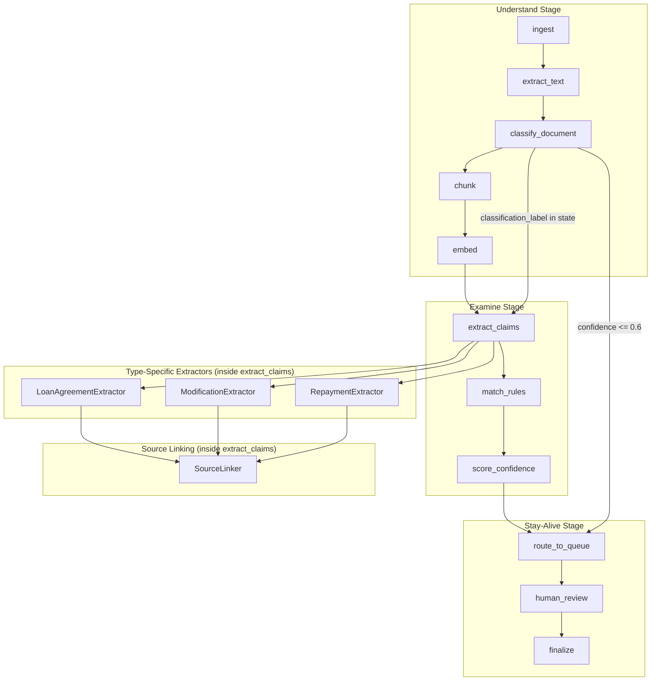
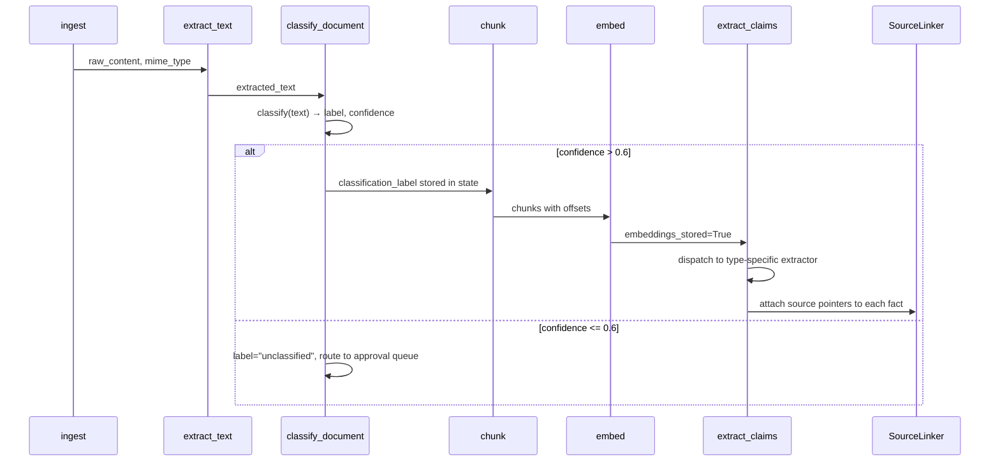

# Design Document: Microfinance Ingestion Pipeline

## Overview

This design extends the existing LangGraph-based document intelligence pipeline to support microfinance-specific document classification and structured fact extraction. The system introduces a `classify_document` node that runs between the existing `extract_text` and `chunk` nodes, routing documents through type-specific extraction schemas. Each extracted fact carries a precise source pointer (character offsets into the original text) enabling round-trip verification.

The feature also introduces a synthetic document generator for end-to-end testing and a provenance test that validates the extraction-to-source-pointer chain across all document types.

### Key Design Decisions

1. **New node insertion vs. extending existing nodes**: We add a `classify_document` node between `extract_text` and `chunk` rather than extending `extract_claims`. Classification must happen before chunking because the document type determines optimal chunk boundaries (e.g., clause-level for loan agreements, row-level for repayment statements).

2. **Type-specific extraction as strategy pattern**: The `extract_claims` node is extended with a strategy registry that dispatches to type-specific extractors based on the classification result stored in pipeline state.

3. **Source pointers use the existing `SourceLocation` model**: No schema changes are needed — the existing `source_locations` table already has `document_version_id`, `page_number`, `section_id`, `start_offset`, and `end_offset`.

4. **Synthetic generator is a standalone test utility**: It lives under `tests/` and is not part of the production pipeline. It produces deterministic output given a seed.

## Architecture

### High-Level Component Diagram



### Pipeline Flow with Classification



## Components and Interfaces

### 1. Document Classifier Node (`classify_document`)

**Location:** `src/pipeline/nodes/classify_document.py`

```python
from typing import Literal, Protocol, Optional
from src.pipeline.state import PipelineState

DocumentType = Literal[
    "loan_agreement",
    "modification_agreement",
    "repayment_statement",
    "unclassified",
]

class ClassificationResult:
    """Result of document classification."""
    label: DocumentType
    confidence: float  # 0.0–1.0
    scores: dict[str, float]  # per-label scores

class DocumentClassifierService(Protocol):
    """Protocol for the classification backend (LLM or ML model)."""
    async def classify(self, text: str) -> ClassificationResult: ...

async def classify_document(
    state: PipelineState,
    *,
    classifier: Optional[DocumentClassifierService] = None,
) -> PipelineState:
    """Classify the document by type and store result in state.

    If max confidence <= 0.6, sets label to 'unclassified' and
    routes to approval queue via error escalation.

    Adds 'classification_label' and 'classification_confidence'
    to state.
    """
    ...
```

**Integration with graph:** Inserted between `extract_text` and `chunk` in `PATH_MAPS` and `NODES`:

```python
PATH_MAPS["extract_text"] = {"next": "classify_document", "retry": "extract_text", "escalate": "route_to_queue"}
PATH_MAPS["classify_document"] = {"next": "chunk", "escalate": "route_to_queue"}
```

### 2. Extended Pipeline State

New fields added to `PipelineState` TypedDict:

```python
class PipelineState(TypedDict):
    # ... existing fields ...

    # Classification outputs (from classify_document node)
    classification_label: Optional[str]  # DocumentType value
    classification_confidence: Optional[float]  # 0.0–1.0
    classification_scores: Optional[dict[str, float]]  # per-label scores
```

### 3. Type-Specific Extraction Strategies

**Location:** `src/pipeline/extractors/`

```python
# src/pipeline/extractors/__init__.py
from src.pipeline.extractors.base import FactExtractor, ExtractedFact
from src.pipeline.extractors.loan_agreement import LoanAgreementExtractor
from src.pipeline.extractors.modification import ModificationExtractor
from src.pipeline.extractors.repayment import RepaymentExtractor
from src.pipeline.extractors.registry import EXTRACTOR_REGISTRY

# src/pipeline/extractors/base.py
from dataclasses import dataclass
from typing import Optional, Protocol

@dataclass
class SourceSpan:
    """Character span within the source text."""
    start_offset: int  # 0-based, inclusive
    end_offset: int    # 0-based, exclusive
    page_number: Optional[int] = None
    section_id: Optional[str] = None

@dataclass
class ExtractedFact:
    """A single extracted fact with source provenance."""
    field_name: str
    value: str  # normalized string representation
    confidence: float  # 0.000–1.000
    source_span: SourceSpan
    fact_group_id: Optional[str] = None  # groups multi-field records

class FactExtractor(Protocol):
    """Protocol for type-specific extraction."""
    async def extract(
        self,
        text: str,
        chunks: list[dict],
    ) -> list[ExtractedFact]: ...

# src/pipeline/extractors/registry.py
EXTRACTOR_REGISTRY: dict[str, type[FactExtractor]] = {
    "loan_agreement": LoanAgreementExtractor,
    "modification_agreement": ModificationExtractor,
    "repayment_statement": RepaymentExtractor,
}
```

### 4. Loan Agreement Extractor

```python
# src/pipeline/extractors/loan_agreement.py
class LoanAgreementExtractor:
    """Extracts structured fields from loan agreements.

    Fields: borrower_name, lender_name, principal_amount, interest_rate,
    interest_type, tenure_months, repayment_frequency, processing_fee, penal_rate
    """

    REQUIRED_FIELDS = [
        "borrower_name", "lender_name", "principal_amount",
        "interest_rate", "interest_type", "tenure_months",
        "repayment_frequency", "processing_fee", "penal_rate",
    ]

    async def extract(self, text: str, chunks: list[dict]) -> list[ExtractedFact]:
        """Extract loan agreement fields with source spans.

        For fields not found: value="not_found", confidence=0.0
        For conflicting values: uses last-in-document, confidence <= 0.5
        Normalizes monetary values to 2 decimal places.
        Normalizes rates to annual percentage with 2 decimal places.
        """
        ...
```

### 5. Modification Agreement Extractor

```python
# src/pipeline/extractors/modification.py
class ModificationExtractor:
    """Extracts term changes from modification agreements.

    Each term change produces a separate fact group:
    original_loan_reference, modified_field_name, original_value,
    new_value, effective_date
    """

    SUPPORTED_FIELDS = [
        "interest_rate", "tenure_months", "emi_amount", "moratorium_period_months"
    ]

    async def extract(self, text: str, chunks: list[dict]) -> list[ExtractedFact]:
        """Extract modification term changes.

        Groups related fields by fact_group_id.
        Skips changes with unsupported modified_field_name.
        """
        ...
```

### 6. Repayment Statement Extractor

```python
# src/pipeline/extractors/repayment.py
class RepaymentExtractor:
    """Extracts payment rows from repayment statements.

    Each row produces a fact group: payment_date, amount_paid,
    late_fee_charged, outstanding_balance, row_index
    """

    async def extract(self, text: str, chunks: list[dict]) -> list[ExtractedFact]:
        """Extract payment rows with 1-based row_index.

        Normalizes dates to ISO 8601 (YYYY-MM-DD).
        Records unparseable dates as value="unparseable", confidence=0.0.
        Records blank/non-numeric monetary fields as value="not_found", confidence=0.0.
        """
        ...
```

### 7. Source Linker

**Location:** `src/pipeline/source_linker.py`

```python
class SourceResolutionError(Exception):
    """Raised when a source pointer cannot be resolved."""
    def __init__(self, claim_id: str, source_location_id: str, reason: str):
        self.claim_id = claim_id
        self.source_location_id = source_location_id
        self.reason = reason
        super().__init__(f"Cannot resolve source for claim {claim_id}: {reason}")

class SourceLinker:
    """Attaches and resolves source pointers for extracted facts."""

    def attach(
        self,
        fact: ExtractedFact,
        document_version_id: str,
    ) -> SourceLocation:
        """Create a SourceLocation record from an ExtractedFact's span.

        Validates: start_offset < end_offset.
        """
        ...

    def resolve(
        self,
        source_location: SourceLocation,
        stored_text: str,
    ) -> str:
        """Resolve a source pointer to the original substring.

        Returns text[start_offset:end_offset].

        Raises:
            SourceResolutionError: If offsets exceed text length or
                document_version_id doesn't exist.
        """
        ...
```

### 8. Synthetic Document Generator

**Location:** `tests/synthetic/generator.py`

```python
@dataclass
class ConflictManifest:
    """Describes embedded factual conflicts in a synthetic pile."""
    conflicts: list[ConflictEntry]

@dataclass
class ConflictEntry:
    """One factual conflict between two documents."""
    field_name: str
    expected_value: str  # from the Modification Agreement
    contradicting_value: str  # in the Repayment Statement
    modification_filename: str
    repayment_filename: str

@dataclass
class SyntheticPile:
    """A generated pile of 5 documents with conflict manifest."""
    documents: list[SyntheticDocument]  # exactly 5
    manifest: ConflictManifest

class SyntheticDocumentGenerator:
    """Generates realistic microfinance document piles for testing.

    Produces exactly 5 documents (≥1 loan, ≥1 modification, ≥1 repayment)
    with exactly 2 factual conflicts between modification and repayment docs.
    """

    def __init__(self, seed: Optional[int] = None):
        self._rng = random.Random(seed)

    def generate(self) -> SyntheticPile:
        """Generate a complete pile with conflict manifest.

        Ensures:
        - Chronological coherence (loan date < mod date < repayment dates)
        - Common loan reference across all documents
        - At least 2 of 3 formats (PDF, DOCX, plain text)
        - Realistic structure (headers, clause numbering, dates, amounts)
        """
        ...
```

### 9. Provenance End-to-End Test

**Location:** `tests/test_provenance_e2e.py`

```python
class TestProvenanceEndToEnd:
    """End-to-end test: synthetic pile → pipeline → source pointer verification."""

    def test_all_facts_have_valid_source_pointers(self):
        """Ingest 5 synthetic docs, verify every fact has a resolvable pointer.

        Asserts:
        1. All 5 documents produce ≥1 extracted fact
        2. Every fact has exactly 1 source_location record
        3. start_offset < end_offset for every pointer
        4. Resolved substring is non-empty
        5. Re-parsing resolved substring produces same value (round-trip)
        6. No SourceResolutionError raised during resolution
        """
        ...
```

## Data Models

### Mapping to Existing Tables

The microfinance extraction maps directly onto the existing `claims` and `source_locations` tables without schema changes:

| Extraction Concept | Table | Column | Notes |
|---|---|---|---|
| Extracted fact | `claims` | `extracted_text` | Normalized value string |
| Document type | `claims` | `claim_type` | `"loan_agreement.principal_amount"` etc. |
| Confidence | `claims` | `confidence` | Decimal(4,3), 0.000–1.000 |
| Source span start | `source_locations` | `start_offset` | 0-based character position |
| Source span end | `source_locations` | `end_offset` | 0-based, exclusive |
| Page (PDF) | `source_locations` | `page_number` | Integer or NULL |
| Section (DOCX/text) | `source_locations` | `section_id` | String or NULL |
| Loan reference | `source_locations` | `clause_ref` | Original loan account ID |

### Claim Type Naming Convention

The `claim_type` field uses a compound format: `{document_type}.{field_name}`:

- `loan_agreement.borrower_name`
- `loan_agreement.principal_amount`
- `modification_agreement.new_value`
- `repayment_statement.amount_paid`

For repayment rows, `claim_type` includes the row index: `repayment_statement.row_3.amount_paid`

### ExtractedFact → Claim/SourceLocation Mapping

```python
def persist_fact(
    fact: ExtractedFact,
    document_version_id: str,
    run_id: str,
    document_type: str,
    session: Session,
) -> tuple[Claim, SourceLocation]:
    """Persist an ExtractedFact as a Claim + SourceLocation pair."""
    claim = Claim(
        document_version_id=uuid.UUID(document_version_id),
        run_id=uuid.UUID(run_id),
        extracted_text=fact.value,
        claim_type=f"{document_type}.{fact.field_name}",
        confidence=Decimal(str(round(fact.confidence, 3))),
    )
    session.add(claim)
    session.flush()  # get claim.id

    source_location = SourceLocation(
        claim_id=claim.id,
        document_version_id=uuid.UUID(document_version_id),
        page_number=fact.source_span.page_number,
        section_id=fact.source_span.section_id,
        start_offset=fact.source_span.start_offset,
        end_offset=fact.source_span.end_offset,
        clause_ref=fact.fact_group_id,
    )
    session.add(source_location)
    return claim, source_location
```

### State Extension for Classification

```python
# Added to PipelineState TypedDict in state.py
classification_label: Optional[str]       # "loan_agreement" | "modification_agreement" | "repayment_statement" | "unclassified"
classification_confidence: Optional[float] # 0.0–1.0
classification_scores: Optional[dict[str, float]]  # {"loan_agreement": 0.85, ...}
```

### Synthetic Document Data Model

```python
@dataclass
class SyntheticDocument:
    """A generated document with known ground truth."""
    filename: str
    document_type: str  # "loan_agreement" | "modification_agreement" | "repayment_statement"
    format: str  # "pdf" | "docx" | "text"
    content: bytes  # raw file bytes
    text_content: str  # plain text representation (ground truth)
    ground_truth_facts: list[GroundTruthFact]

@dataclass
class GroundTruthFact:
    """A known fact embedded in the synthetic document."""
    field_name: str
    value: str
    start_offset: int  # in text_content
    end_offset: int    # in text_content
```


## Correctness Properties

*A property is a characteristic or behavior that should hold true across all valid executions of a system — essentially, a formal statement about what the system should do. Properties serve as the bridge between human-readable specifications and machine-verifiable correctness guarantees.*

### Property 1: Classification Output Validity

*For any* document text (non-empty, from a supported MIME type), the classifier SHALL produce exactly one label from {loan_agreement, modification_agreement, repayment_statement, unclassified} with a confidence score in [0.0, 1.0], where the label is "unclassified" if and only if all candidate scores are ≤ 0.6.

**Validates: Requirements 1.1, 1.2**

### Property 2: Unsupported MIME Rejection

*For any* MIME type string that is not in {application/pdf, application/vnd.openxmlformats-officedocument.wordprocessingml.document, text/plain}, submitting a document with that MIME type SHALL produce an error with code UNSUPPORTED_FORMAT.

**Validates: Requirements 1.4**

### Property 3: Extraction Schema Completeness

*For any* classified document, the extraction output SHALL contain exactly the required field names for that document type: {borrower_name, lender_name, principal_amount, interest_rate, interest_type, tenure_months, repayment_frequency, processing_fee, penal_rate} for loan agreements; {original_loan_reference, modified_field_name, original_value, new_value, effective_date} per term change for modifications; {payment_date, amount_paid, late_fee_charged, outstanding_balance} per row for repayment statements.

**Validates: Requirements 2.1, 3.1, 4.1**

### Property 4: Missing Field Handling

*For any* document where a required field is absent, blank, non-numeric (for monetary fields), or unparseable (for date fields), the extractor SHALL record that field with value "not_found" (or "unparseable" for dates) and confidence exactly 0.0, while extracting remaining fields normally.

**Validates: Requirements 2.2, 2.4, 3.5, 4.5, 4.6**

### Property 5: Monetary Normalization

*For any* valid monetary string extracted from a document (with a stated currency), the normalized output SHALL be a numeric value with exactly 2 decimal places.

**Validates: Requirements 2.3, 4.3**

### Property 6: Rate Normalization

*For any* interest rate or penal rate value extracted from a document, the normalized output SHALL be an annual percentage value with exactly 2 decimal places. For modification agreements, tenure and moratorium values SHALL be normalized to whole months.

**Validates: Requirements 2.5, 3.6**

### Property 7: Confidence Score Bounds

*For any* extracted fact from any document type, the assigned confidence score SHALL be a value in the range [0.0, 1.0] inclusive, with at most 3 decimal places of precision.

**Validates: Requirements 2.6, 4.7**

### Property 8: Conflict Resolution Picks Last Value

*For any* document containing multiple conflicting values for the same field, the extractor SHALL select the value from the clause appearing last in document order (or latest-dated clause), and SHALL assign a confidence score no higher than 0.5 to that field.

**Validates: Requirements 2.7**

### Property 9: Modification Field Filtering

*For any* modification agreement containing term changes, the extractor SHALL produce fact records only for changes whose modified_field_name is in {interest_rate, tenure_months, emi_amount, moratorium_period_months}, and SHALL skip all other field changes.

**Validates: Requirements 3.2**

### Property 10: Multi-Change Cardinality

*For any* modification agreement containing N supported term changes, the extractor SHALL produce exactly N fact groups, each containing the required fields for a term change.

**Validates: Requirements 3.4**

### Property 11: Date Normalization to ISO 8601

*For any* valid date string in a repayment statement (regardless of input format), the normalized output SHALL match the pattern YYYY-MM-DD and represent the same calendar date as the input.

**Validates: Requirements 4.2**

### Property 12: Sequential Row Indexing

*For any* repayment statement containing N payment rows, the extractor SHALL assign row_index values from 1 to N (inclusive) in document order, with no gaps or duplicates.

**Validates: Requirements 4.4**

### Property 13: Source Pointer Structural Validity

*For any* extracted fact, the associated source pointer SHALL have start_offset strictly less than end_offset, a valid document_version_id, and either page_number (for PDF) or section_id (for DOCX/text) populated.

**Validates: Requirements 5.1, 5.2**

### Property 14: Source Pointer Resolution Correctness

*For any* valid source pointer (where offsets are within the document text length), resolving the pointer against the stored text SHALL return exactly `text[start_offset:end_offset]` — the substring from start_offset (inclusive) to end_offset (exclusive).

**Validates: Requirements 5.3**

### Property 15: Extraction Round-Trip

*For any* extracted fact with a valid source pointer, resolving the pointer to obtain the source substring and re-parsing that substring using the same extraction logic SHALL yield a structured value identical to the originally extracted fact value.

**Validates: Requirements 5.5**

### Property 16: Source Resolution Error Reporting

*For any* source pointer where offsets exceed the document text length or the document_version_id does not exist, attempting resolution SHALL raise a SourceResolutionError containing the claim_id, source_location_id, and a reason string.

**Validates: Requirements 5.6**

### Property 17: Generator Output Structure

*For any* integer seed, the synthetic generator SHALL produce exactly 5 documents with at least 1 of each type (loan, modification, repayment), exactly 2 factual conflicts, and documents in at least 2 of the 3 supported formats.

**Validates: Requirements 6.1, 6.2, 6.4**

### Property 18: Conflict Manifest Validity

*For any* generated pile, each entry in the conflict manifest SHALL reference exactly one modification agreement and one repayment statement (by filename), and SHALL contain non-empty field_name, expected_value, and contradicting_value.

**Validates: Requirements 6.3, 6.6**

### Property 19: Chronological Coherence

*For any* generated pile, the loan agreement date SHALL precede all modification effective dates, each modification effective date SHALL precede the earliest repayment payment date that relates to it, and all documents SHALL share a common loan reference identifier.

**Validates: Requirements 6.7**

### Property 20: Generator Determinism

*For any* integer seed, invoking the synthetic generator twice with the same seed SHALL produce byte-identical output (same documents, same manifest, same ordering).

**Validates: Requirements 6.8**

## Error Handling

### Classification Errors

| Condition | Error Code | Behavior |
|---|---|---|
| Unsupported MIME type | `UNSUPPORTED_FORMAT` | Permanent error, no retry |
| Unparseable content (zero text, corruption) | `PARSE_FAILURE` | Permanent error, no retry |
| All classification scores ≤ 0.6 | N/A (not an error) | Routes to approval queue as "unclassified" |
| Classifier service timeout | Transient error | Retried per `max_retries` config |
| Classifier service unavailable | Transient error | Retried per `max_retries` config |

### Extraction Errors

| Condition | Behavior |
|---|---|
| Required field not found | Record as `not_found`, confidence 0.0, continue extraction |
| Unparseable date | Record as `unparseable`, confidence 0.0, continue extraction |
| Blank/non-numeric monetary field | Record as `not_found`, confidence 0.0, continue extraction |
| LLM API failure during extraction | Transient error, retried |
| Multiple conflicting values | Extract last-in-document, confidence ≤ 0.5 |
| Unsupported modification field | Skip silently, no fact record |

### Source Pointer Errors

| Condition | Exception | Contains |
|---|---|---|
| start_offset >= end_offset | `ValueError` at attach time | Details of the invalid span |
| Offsets exceed text length | `SourceResolutionError` | claim_id, source_location_id, "out-of-bounds" |
| Non-existent document_version_id | `SourceResolutionError` | claim_id, source_location_id, "missing document version" |

### Pipeline Graph Error Routing

The `classify_document` node integrates with the existing routing/retry infrastructure:

```python
PATH_MAPS["classify_document"] = {
    "next": "chunk",            # classification successful
    "escalate": "route_to_queue",  # unclassified (low confidence) or permanent error
    "retry": "classify_document",  # transient error (service timeout)
}
```

## Testing Strategy

### Property-Based Testing (Hypothesis)

This feature is well-suited for property-based testing because it involves:
- Data transformation and normalization (parsers, formatters)
- Universal invariants on output structure (schema completeness, confidence bounds)
- Round-trip properties (extraction → source resolution → re-parse)
- Deterministic generators with structural invariants

**Library:** `hypothesis` (already in dev dependencies)

**Configuration:** Minimum 100 examples per property test (`@settings(max_examples=100)`)

**Test tag format:** `Feature: microfinance-ingestion-pipeline, Property {N}: {title}`

Each correctness property maps to a single `@given`-decorated test function.

### Test File Organization

```
tests/
├── microfinance/
│   ├── __init__.py
│   ├── test_properties_classifier.py      # Properties 1, 2
│   ├── test_properties_extraction.py      # Properties 3–12
│   ├── test_properties_source_linker.py   # Properties 13–16
│   ├── test_properties_generator.py       # Properties 17–20
│   ├── test_provenance_e2e.py             # Integration test (Req 7)
│   └── conftest.py                        # Shared strategies and fixtures
├── synthetic/
│   └── generator.py                       # Synthetic document generator
```

### Hypothesis Strategies

Key custom strategies needed:

```python
# conftest.py or strategies.py
@st.composite
def loan_agreement_text(draw) -> str:
    """Generate realistic loan agreement text with known fields."""
    ...

@st.composite
def modification_text(draw) -> str:
    """Generate modification agreement text with known term changes."""
    ...

@st.composite
def repayment_text(draw) -> str:
    """Generate repayment statement text with known payment rows."""
    ...

@st.composite
def monetary_string(draw) -> tuple[str, float]:
    """Generate a monetary string and its expected normalized value."""
    ...

@st.composite
def date_string(draw) -> tuple[str, str]:
    """Generate a date string and its expected ISO 8601 output."""
    ...

@st.composite
def source_pointer_and_text(draw) -> tuple[SourceSpan, str]:
    """Generate a valid source pointer and matching text."""
    ...
```

### Unit Tests (Example-Based)

Complement property tests with specific examples:

- Classification of a known loan agreement (expected: loan_agreement, high confidence)
- Extraction of a sample 3-row repayment statement (verify row count, field values)
- Source resolution of a known offset pair
- Error handling for corrupted PDF bytes

### Integration Tests

- **Provenance E2E test** (Requirement 7): Full pipeline on synthetic pile
- **Database persistence test**: Verify FK relationships between claims and source_locations
- **Graph integration**: Verify classify_document node wires correctly into the LangGraph

### Test Execution

```bash
# Run all property tests
pytest tests/microfinance/test_properties_*.py -v

# Run provenance E2E test
pytest tests/microfinance/test_provenance_e2e.py -v

# Run with hypothesis verbose output
pytest tests/microfinance/ --hypothesis-show-statistics
```
