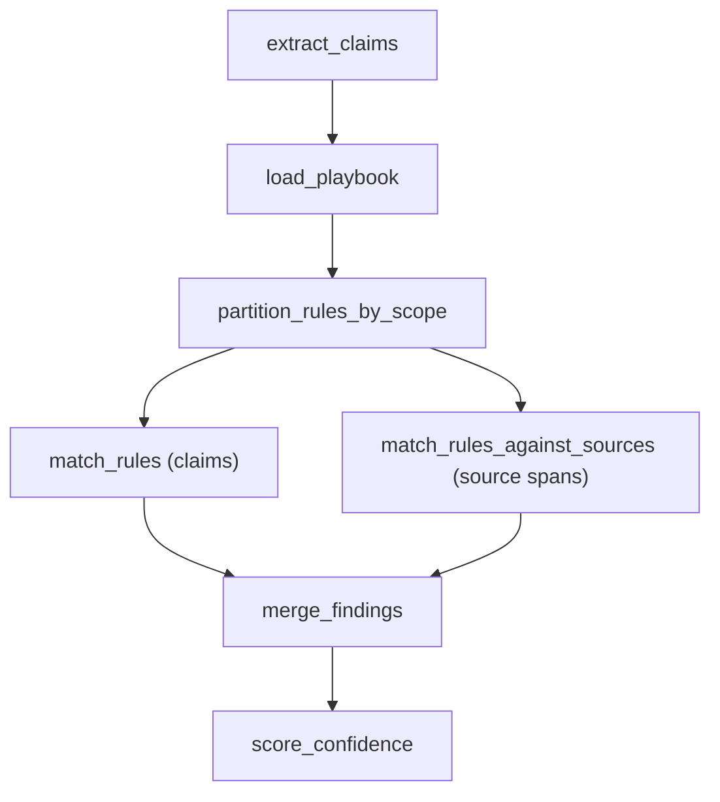

# Design Document: Rules Checking Stage

## Overview

This design specifies the `match_rules_against_sources` node — a parallel companion to the existing `match_rules` node in the Examine Stage. While `match_rules` evaluates extracted claims against compliance rules, the new node evaluates rules directly against source document spans. Rules are authored in YAML playbooks, validated via Pydantic at load time, and evaluated via LLM (default) or deterministic structured checks (opt-in).

**Key principles:**

- **Parallel execution** — Both `match_rules` and `match_rules_against_sources` run concurrently after `extract_claims`, converging before `score_confidence`.
- **Honest output** — Findings are produced only on actual violations (`verdict == "fail"`). No padding, no forced findings.
- **Exact citations** — Every finding carries the precise source span (start/end offsets + text) that triggered it.
- **Extensibility** — New rules are added by editing YAML playbooks; no Python code changes required.
- **Dual evaluation** — LLM-based evaluation (default) for complex regulatory language; structured evaluation (opt-in) for deterministic, reproducible checks.

---

## Architecture

### Updated Pipeline Graph Topology



The `load_playbook` and `partition_rules_by_scope` steps are implemented as the entry logic of a fan-out subgraph. LangGraph's `Send` API or a branching conditional edge dispatches rules to the appropriate node(s). The `merge_findings` step collects results from both branches before continuing to `score_confidence`.

### Graph Integration Strategy

The pipeline graph modifications:

1. **New node**: `match_rules_against_sources` added to `NODES` dict
2. **Modified routing**: After `extract_claims`, a fan-out dispatches to both `match_rules` and `match_rules_against_sources` in parallel
3. **New merge node**: `merge_findings` collects outputs from both rule-checking nodes
4. **Updated PATH_MAPS**: `extract_claims` routes to the fan-out; `merge_findings` routes to `score_confidence`

```python
# Updated PATH_MAPS (conceptual)
PATH_MAPS["extract_claims"] = {
    "next": "fan_out_rules",  # dispatches to both match_rules nodes
    "retry": "extract_claims",
    "escalate": "route_to_queue",
}
PATH_MAPS["merge_findings"] = {
    "next": "score_confidence",
    "escalate": "route_to_queue",
}
```

---

## Components and Interfaces

### Component 1: Playbook Schema (Pydantic Model)

```python
from typing import Literal, Optional
from pydantic import BaseModel, Field, field_validator


class RuleDefinition(BaseModel):
    """A single compliance rule within a playbook."""

    id: str = Field(..., description="Unique rule identifier")
    description: str = Field(..., description="Human-readable rule description")
    check_description: str = Field(
        ..., description="Detailed instructions for evaluation"
    )
    scope: Literal["claims", "source", "both"] = Field(
        ..., description="Which pipeline path evaluates this rule"
    )
    check_type: Literal["llm", "structured"] = Field(
        default="llm", description="Evaluation method"
    )

    @field_validator("id")
    @classmethod
    def id_not_empty(cls, v: str) -> str:
        if not v.strip():
            raise ValueError("Rule id must not be empty")
        return v


class Playbook(BaseModel):
    """A validated playbook loaded from YAML."""

    playbook_id: str = Field(..., description="Matches the whitelist key")
    name: str = Field(..., description="Human-readable playbook name")
    version: str = Field(default="1.0", description="Playbook version")
    rules: list[RuleDefinition] = Field(
        ..., description="Unbounded list of compliance rules"
    )

    @field_validator("rules")
    @classmethod
    def rules_have_unique_ids(cls, v: list[RuleDefinition]) -> list[RuleDefinition]:
        ids = [r.id for r in v]
        if len(ids) != len(set(ids)):
            raise ValueError("Rule ids must be unique within a playbook")
        return v
```

### Playbook YAML Schema

```yaml
# rules/microfinance_v1.yaml
playbook_id: microfinance_v1
name: "Microfinance Compliance Rules v1"
version: "1.0"
rules:
  - id: "MF-001"
    description: "APR must not exceed 36%"
    check_description: >
      Check if the stated annual percentage rate (APR) exceeds 36%.
      Look for interest rate declarations in loan terms.
    scope: source
    check_type: llm

  - id: "MF-002"
    description: "Processing fee must be disclosed"
    check_description: >
      Verify that a processing fee amount is explicitly stated in the document.
    scope: both

  - id: "MF-003"
    description: "Interest rate matches modification"
    check_description: >
      The interest rate in repayment statements must match the rate in the
      most recent modification agreement.
    scope: claims
    check_type: structured
```

---

### Component 2: Playbook Loader

```python
from pathlib import Path
from typing import Optional

# Whitelist of known playbook IDs → filenames
PLAYBOOK_WHITELIST: dict[str, str] = {
    "microfinance_v1": "microfinance_v1.yaml",
    "consumer_lending_v1": "consumer_lending_v1.yaml",
}

RULES_DIR = Path("rules")


class PlaybookLoadError(Exception):
    """Raised when playbook loading fails (permanent error)."""
    pass


async def load_playbook(playbook_id: str) -> Playbook:
    """Resolve, load, and validate a playbook by ID.

    Args:
        playbook_id: Must match a key in PLAYBOOK_WHITELIST.

    Returns:
        Validated Playbook model.

    Raises:
        PlaybookLoadError: If playbook_id is unknown or YAML is invalid.
    """
    if playbook_id not in PLAYBOOK_WHITELIST:
        raise PlaybookLoadError(
            f"Unknown playbook_id '{playbook_id}'. "
            f"Valid options: {list(PLAYBOOK_WHITELIST.keys())}"
        )

    yaml_path = RULES_DIR / PLAYBOOK_WHITELIST[playbook_id]
    if not yaml_path.exists():
        raise PlaybookLoadError(f"Playbook file not found: {yaml_path}")

    import yaml
    with open(yaml_path) as f:
        raw = yaml.safe_load(f)

    try:
        return Playbook.model_validate(raw)
    except Exception as e:
        raise PlaybookLoadError(f"Playbook validation failed: {e}") from e
```

---

### Component 3: Rule Scope Partitioner

```python
from dataclasses import dataclass


@dataclass
class PartitionedRules:
    """Rules partitioned by evaluation target."""

    claims_rules: list[RuleDefinition]  # scope == "claims" or "both"
    source_rules: list[RuleDefinition]  # scope == "source" or "both"


def partition_rules(playbook: Playbook) -> PartitionedRules:
    """Partition playbook rules by scope for routing to correct nodes.

    Rules with scope "both" appear in both lists.

    Args:
        playbook: Validated Playbook model.

    Returns:
        PartitionedRules with claims_rules and source_rules.
    """
    claims_rules: list[RuleDefinition] = []
    source_rules: list[RuleDefinition] = []

    for rule in playbook.rules:
        if rule.scope in ("claims", "both"):
            claims_rules.append(rule)
        if rule.scope in ("source", "both"):
            source_rules.append(rule)

    return PartitionedRules(
        claims_rules=claims_rules,
        source_rules=source_rules,
    )
```

---

### Component 4: Finding Data Model

```python
from dataclasses import dataclass
from typing import Literal


FindingVerdict = Literal["pass", "fail", "not_applicable", "insufficient_evidence"]
EvaluationMethod = Literal["llm", "structured"]


@dataclass
class CitedSpan:
    """Exact source location cited by a finding."""

    start_offset: int  # 0-based, inclusive
    end_offset: int    # 0-based, exclusive
    text: str          # exact text at [start_offset:end_offset]


@dataclass
class EvaluationResult:
    """Result from evaluating a single rule against a single span."""

    rule_id: str
    verdict: FindingVerdict
    cited_span: CitedSpan
    explanation: str
    evaluation_method: EvaluationMethod


@dataclass
class Finding:
    """A confirmed rule violation with full provenance.

    Only produced when verdict == "fail".
    """

    rule_id: str
    verdict: Literal["fail"]  # always "fail" — findings are violations only
    cited_span: CitedSpan
    explanation: str
    evaluation_method: EvaluationMethod
```

---

### Component 5: Evaluator Protocol and Implementations

```python
from typing import Protocol


class RuleEvaluator(Protocol):
    """Protocol for evaluating a rule against a source span."""

    async def evaluate(
        self,
        rule: RuleDefinition,
        span_text: str,
        span_offset: int,
    ) -> EvaluationResult:
        """Evaluate a single rule against a source span.

        Args:
            rule: The rule to evaluate.
            span_text: The text content of the source span.
            span_offset: The start offset of the span in the original document.

        Returns:
            EvaluationResult with verdict, cited_span, and explanation.
        """
        ...


class LLMEvaluator:
    """Evaluates rules using LLM with structured output."""

    async def evaluate(
        self,
        rule: RuleDefinition,
        span_text: str,
        span_offset: int,
    ) -> EvaluationResult:
        """Send rule + span to LLM, parse structured response.

        The LLM prompt includes:
        - Rule description and check_description
        - The source span text
        - Instructions to return verdict, cited_span, and explanation

        Returns EvaluationResult with evaluation_method="llm".
        Raises Exception on API failure (caught by node as transient error).
        """
        ...

    async def evaluate_batch(
        self,
        rules: list[RuleDefinition],
        span_text: str,
        span_offset: int,
    ) -> list[EvaluationResult]:
        """Evaluate multiple rules against a single span in one LLM call.

        Reduces API calls by batching rules per span.
        """
        ...


class StructuredEvaluator:
    """Evaluates rules using deterministic structured logic."""

    # Registry of supported check_descriptions
    SUPPORTED_CHECKS: dict[str, callable] = {}

    def supports(self, rule: RuleDefinition) -> bool:
        """Return True if this evaluator can handle the rule."""
        return rule.check_description in self.SUPPORTED_CHECKS

    async def evaluate(
        self,
        rule: RuleDefinition,
        span_text: str,
        span_offset: int,
    ) -> EvaluationResult:
        """Execute deterministic check logic.

        Returns EvaluationResult with evaluation_method="structured".
        """
        ...
```

---

### Component 6: `match_rules_against_sources` Node

```python
import logging

logger = logging.getLogger(__name__)


async def match_rules_against_sources(
    state: PipelineState,
    *,
    llm_evaluator: LLMEvaluator | None = None,
    structured_evaluator: StructuredEvaluator | None = None,
) -> PipelineState:
    """Evaluate rules directly against source document spans.

    Reads source_rules from state (populated by the partitioner),
    evaluates each rule against available source spans, and produces
    findings only for violations (verdict == "fail").

    Args:
        state: Pipeline state with source_rules and source spans.
        llm_evaluator: LLM-based evaluator (required for llm rules).
        structured_evaluator: Structured evaluator (optional, falls back to LLM).

    Returns:
        Updated PipelineState with findings list populated.
    """
    source_rules = state.get("source_rules", [])
    chunks = state.get("chunks", [])

    # No applicable rules → empty findings, completed
    if not source_rules:
        return _completed_state(state, findings=[])

    # No source spans available → empty findings, completed
    if not chunks:
        return _completed_state(state, findings=[])

    findings: list[Finding] = []

    try:
        for chunk in chunks:
            span_text = chunk["text"]
            span_offset = chunk["start_offset"]

            # Partition rules for this span by check_type
            llm_rules = []
            structured_rules = []

            for rule in source_rules:
                if rule.check_type == "structured":
                    if structured_evaluator and structured_evaluator.supports(rule):
                        structured_rules.append(rule)
                    else:
                        # Fall back to LLM for unsupported structured rules
                        logger.warning(
                            f"Structured evaluator does not support rule "
                            f"'{rule.id}', falling back to LLM"
                        )
                        llm_rules.append(rule)
                else:
                    llm_rules.append(rule)

            # Batch LLM evaluation (multiple rules per span)
            if llm_rules and llm_evaluator:
                results = await llm_evaluator.evaluate_batch(
                    llm_rules, span_text, span_offset
                )
                for result in results:
                    if result.verdict == "fail":
                        findings.append(_result_to_finding(result))

            # Individual structured evaluations
            for rule in structured_rules:
                result = await structured_evaluator.evaluate(
                    rule, span_text, span_offset
                )
                if result.verdict == "fail":
                    findings.append(_result_to_finding(result))

    except Exception as exc:
        # LLM API failure → transient error
        return _transient_error_state(state, str(exc))

    return _completed_state(state, findings=findings)


def _result_to_finding(result: EvaluationResult) -> Finding:
    """Convert a failing EvaluationResult to a Finding."""
    return Finding(
        rule_id=result.rule_id,
        verdict="fail",
        cited_span=result.cited_span,
        explanation=result.explanation,
        evaluation_method=result.evaluation_method,
    )


def _completed_state(state: PipelineState, *, findings: list[Finding]) -> PipelineState:
    """Return completed state with findings."""
    completed_nodes = list(state.get("completed_nodes", []))
    completed_nodes.append("match_rules_against_sources")
    return PipelineState(
        **{
            **state,
            "findings": findings,
            "current_node": "match_rules_against_sources",
            "node_status": "completed",
            "error_type": None,
            "error_detail": None,
            "completed_nodes": completed_nodes,
        }
    )


def _transient_error_state(state: PipelineState, detail: str) -> PipelineState:
    """Return transient error state."""
    return PipelineState(
        **{
            **state,
            "current_node": "match_rules_against_sources",
            "node_status": "error",
            "error_type": "transient",
            "error_detail": f"LLM API failure: {detail}",
            "completed_nodes": list(state.get("completed_nodes", [])),
        }
    )
```

---

### Component 7: Pipeline State Extension

```python
# New fields added to PipelineState TypedDict

class PipelineState(TypedDict):
    # ... existing fields ...

    # Rules Checking Stage additions
    playbook_id: Optional[str]           # Set at run init, stored on run record
    source_rules: list[dict]             # Rules routed to match_rules_against_sources
    claims_rules: list[dict]             # Rules routed to match_rules
    findings: list[dict]                 # Merged findings from both rule-checking nodes
```

The `findings` field is a list of serialized `Finding` dicts. After the merge step, it contains findings from both `match_rules` (claim-based) and `match_rules_against_sources` (span-based).

---

### Component 8: Findings Merge Node

```python
async def merge_findings(state: PipelineState) -> PipelineState:
    """Merge findings from both rule-checking nodes.

    Concatenates claim-based findings and source-based findings
    into a single list. No deduplication — both perspectives are valid.

    Args:
        state: Pipeline state after both match_rules nodes complete.

    Returns:
        Updated state with merged findings list.
    """
    claim_findings = state.get("claim_findings", [])
    source_findings = state.get("source_findings", [])

    merged = claim_findings + source_findings

    completed_nodes = list(state.get("completed_nodes", []))
    completed_nodes.append("merge_findings")

    return PipelineState(
        **{
            **state,
            "findings": merged,
            "current_node": "merge_findings",
            "node_status": "completed",
            "error_type": None,
            "error_detail": None,
            "completed_nodes": completed_nodes,
        }
    )
```

---

## Data Models

### Finding Schema (Serialized)

```python
# JSON representation stored in PipelineState["findings"]
{
    "rule_id": "MF-001",
    "verdict": "fail",
    "cited_span": {
        "start_offset": 245,
        "end_offset": 289,
        "text": "annual interest rate of 42.00%"
    },
    "explanation": "The stated APR of 42% exceeds the 36% regulatory maximum.",
    "evaluation_method": "llm"
}
```

### EvaluationResult Schema (Internal)

```python
{
    "rule_id": "MF-001",
    "verdict": "fail" | "pass" | "not_applicable" | "insufficient_evidence",
    "cited_span": {
        "start_offset": int,
        "end_offset": int,
        "text": str
    },
    "explanation": str,
    "evaluation_method": "llm" | "structured"
}
```

### Playbook File Discovery

| Playbook ID | File Path |
|-------------|-----------|
| `microfinance_v1` | `rules/microfinance_v1.yaml` |
| `consumer_lending_v1` | `rules/consumer_lending_v1.yaml` |

New playbooks are added by:
1. Creating a YAML file under `rules/`
2. Adding the mapping to `PLAYBOOK_WHITELIST`

---

## Error Handling

### Error Classification

| Condition | Error Type | Behavior |
|-----------|-----------|----------|
| Unknown playbook_id | `permanent` | Stop immediately, no retry |
| YAML file missing | `permanent` | Stop immediately, no retry |
| YAML schema validation failure | `permanent` | Stop immediately, include validation details |
| LLM API call failure | `transient` | Retry up to `max_retries` |
| No source spans available | N/A (completed) | Return empty findings, status "completed" |
| No applicable source rules | N/A (completed) | Return empty findings, status "completed" |
| Structured evaluator unsupported | N/A (warning) | Fall back to LLM, log warning |

### Error State Transitions

```
match_rules_against_sources
  ├── permanent error → escalate (via routing) → route_to_queue
  ├── transient error → retry (if retries < max) → match_rules_against_sources
  ├── transient error → escalate (if retries >= max) → route_to_queue
  └── completed → next → merge_findings
```

---

## Test Strategy

### Clean Corpus Test

A test corpus with documents that pass all rules. Expected output: zero findings.

```python
async def test_clean_corpus_produces_no_findings():
    """Run match_rules_against_sources against a clean corpus.

    Setup:
    - Load a playbook with known rules
    - Provide source spans from a document that complies with all rules
    - Use a mock LLM that returns "pass" for all evaluations

    Assert:
    - findings list is empty
    - node_status is "completed"
    """
```

### Violation Corpus Test

A test corpus with exactly one known violation. Expected output: exactly one finding with correct rule_id and span.

```python
async def test_violation_corpus_produces_one_finding():
    """Run match_rules_against_sources against a corpus with one violation.

    Setup:
    - Load a playbook with known rules
    - Provide source spans containing exactly one rule violation at a known offset
    - Use a mock LLM that returns "fail" for the violating rule and "pass" for others

    Assert:
    - findings list has exactly 1 entry
    - finding.rule_id matches the violated rule
    - finding.cited_span.start_offset and end_offset match the violation location
    - finding.evaluation_method is correct
    """
```

### Property-Based Test Strategy

Property tests use Hypothesis to generate:
- Random playbook structures (varying rule counts, scopes, check_types)
- Random source span text and offsets
- Random evaluation results (verdicts)

And verify invariants hold across all generated inputs.

---

## Testing Strategy

### Unit Tests

- **Playbook loading**: Verify schema validation accepts valid YAML and rejects invalid structures with descriptive errors
- **Rule partitioning**: Verify scope-based routing produces correct subsets
- **Finding construction**: Verify findings are only produced from "fail" verdicts
- **Error classification**: Verify LLM failures → transient, config failures → permanent
- **Structured evaluator fallback**: Verify unsupported rules fall back to LLM with warning

### Property-Based Tests (Hypothesis)

- Minimum 100 iterations per property test
- Generators produce random playbooks, rules, source spans, and evaluation results
- Properties validate invariants across all generated inputs (see Correctness Properties below)

### Integration Tests

- **Clean corpus test**: Full node execution against compliant documents → zero findings
- **Violation corpus test**: Full node execution against documents with one known violation → exactly one finding with correct rule_id and matching span location
- **Parallel execution**: Verify both `match_rules` and `match_rules_against_sources` execute concurrently in the graph
- **End-to-end pipeline**: Full pipeline run with playbook_id set, verifying findings appear in final state

### Test Corpus Design

| Corpus | Documents | Expected Findings | Purpose |
|--------|-----------|-------------------|---------|
| Clean | Compliant loan agreement | 0 | Verify no false positives |
| Violation | Loan with APR > 36% | 1 (MF-001) | Verify detection and citation |
| Mixed | Multiple docs, some compliant | Subset | Verify selective detection |

---

## Correctness Properties

*A property is a characteristic or behavior that should hold true across all valid executions of a system — essentially, a formal statement about what the system should do. Properties serve as the bridge between human-readable specifications and machine-verifiable correctness guarantees.*

### Property 1: Playbook Schema Round-Trip

*For any* valid `Playbook` model instance (with any number of rules, any valid scopes, and any valid check_types), serializing to a dict and parsing back via `Playbook.model_validate()` SHALL produce an equivalent model.

**Validates: Requirements 1.2, 1.5, 1.6**

### Property 2: Invalid Playbook ID Produces Permanent Error

*For any* string that is not a key in the `PLAYBOOK_WHITELIST`, calling `load_playbook()` SHALL raise a `PlaybookLoadError`.

**Validates: Requirements 1.3**

### Property 3: Rule Scope Partitioning Correctness

*For any* valid playbook with N rules, partitioning by scope SHALL produce two lists where: (a) every rule with scope "claims" or "both" appears in `claims_rules`, (b) every rule with scope "source" or "both" appears in `source_rules`, and (c) no rule is lost — the count of unique rule IDs across both lists equals N.

**Validates: Requirements 2.1**

### Property 4: Findings Merge Preserves All Items

*For any* two lists of findings (from claim-based and source-based evaluation), the merged list SHALL have length equal to the sum of both input lengths and contain every item from both inputs.

**Validates: Requirements 2.3**

### Property 5: Empty Inputs Produce Empty Findings

*For any* set of rules, if the source spans list is empty OR the source_rules list is empty, the `match_rules_against_sources` node SHALL return an empty findings list with node_status "completed".

**Validates: Requirements 3.3, 9.3**

### Property 6: Findings Produced If and Only If Verdict Is "fail"

*For any* list of `EvaluationResult` instances returned by evaluators, the resulting findings list SHALL contain exactly those results where `verdict == "fail"` — no more, no fewer.

**Validates: Requirements 6.1, 6.2, 6.3, 4.3**

### Property 7: Finding Structural Completeness

*For any* `Finding` produced by the node, it SHALL contain all required fields with valid values: `rule_id` (non-empty string), `verdict` (literal "fail"), `cited_span` with `start_offset < end_offset` and non-empty `text`, `explanation` (non-empty string), and `evaluation_method` (one of "llm" or "structured").

**Validates: Requirements 6.4, 6.5, 3.4**

### Property 8: Default Check Type Is LLM

*For any* rule definition dict that omits the `check_type` field, parsing via `RuleDefinition.model_validate()` SHALL produce a model with `check_type == "llm"`.

**Validates: Requirements 1.6**

### Property 9: Unbounded Rules Per Playbook

*For any* positive integer N, a playbook containing N rules (each with unique IDs and valid fields) SHALL pass Pydantic validation without error.

**Validates: Requirements 7.3**
